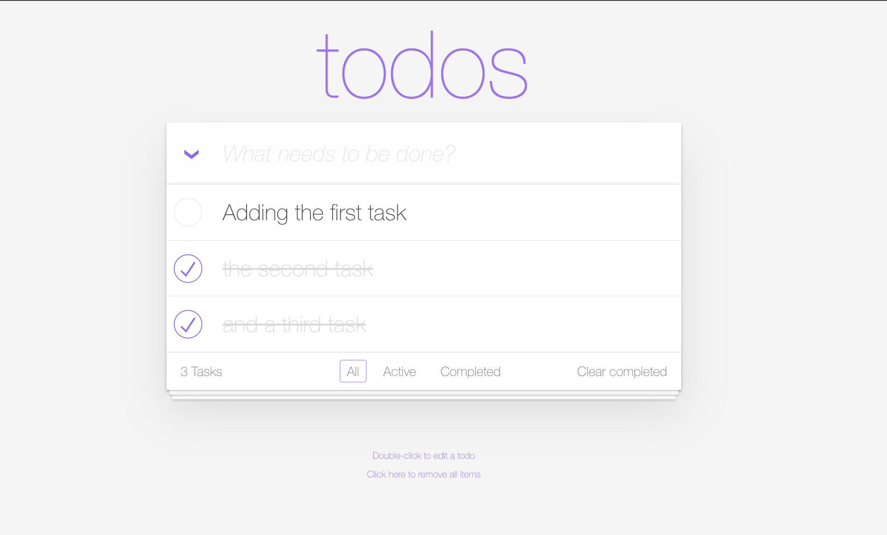

<!-- STEP_SETUP
commands:
  - _check_bug1
-->

!!! note "The Bug — 'Clear completed'"
    Level: Beginner

## Reproduce the bug

Open the TODO app from the **Apps** tab and try it out:

- Add a couple of tasks.
- Complete some of them (or all, depending on how productive you are 😉).
- Click **Clear completed**.

Are the tasks cleared? **No.** When clicked, the completed todos are not removed. That is our first bug.

When you opened this step, we also reproduced the bug for you in the background (added a completed task and clicked *Clear completed* via the API) so Dynatrace has fresh data to hunt through. Confirm the bug is present:

<!-- LAB_QUESTION
type: shell-verification
question: "Confirm the 'Clear completed' bug is reproduced (a completed task was added and clearing it failed)"
buttonText: "Check the bug is there"
command: "source .devcontainer/util/source_framework.sh >/dev/null 2>&1 && is_bug1_there"
expect:
  operator: exit-zero
hint: "Open the TODO app, add a task, mark it completed and click 'Clear completed'. The function `is_bug1_there` inspects the app logs for the failed-delete evidence."
explanation: "The bug is reproduced — the app logged a completed task and a failed clear. Time to hunt it down."
-->

<!-- LAB_QUESTION
type: multiple-choice
question: "The 'Clear completed' button returns HTTP 200 and throws no error, yet nothing is deleted. What does that tell you about where the bug lives?"
options:
  - "It is a logic bug inside the request handler — the wrong collection is being mutated, so the request still succeeds"
  - "It is a network failure between the browser and the cluster"
  - "The pod has crashed and is no longer serving traffic"
  - "Dynatrace is not monitoring the application"
correct: 0
explanation: "A 200 with no effect is the signature of a logic bug: the handler runs to completion but operates on the wrong data. The Live Debugger lets us see exactly which variables are involved — no failure code needed."
-->

There are multiple ways to dive into the issue, because Dynatrace monitors your Kubernetes cluster, all workloads, all their traces with code-level insights, and all real users hitting the app.

- [Hunt the bug via the Kubernetes App :octicons-arrow-right-24:](1-bug-hunt-via-k8s.md)

