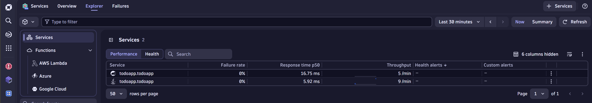
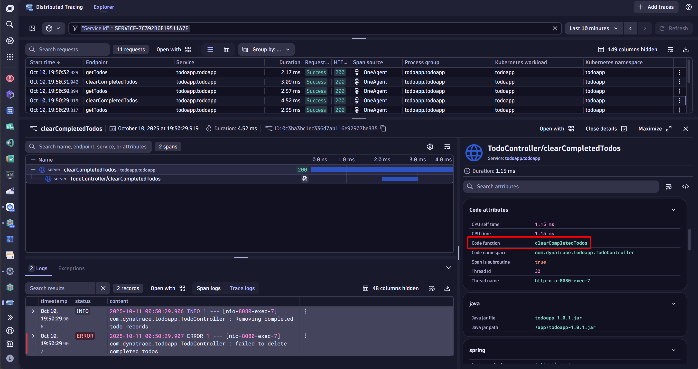
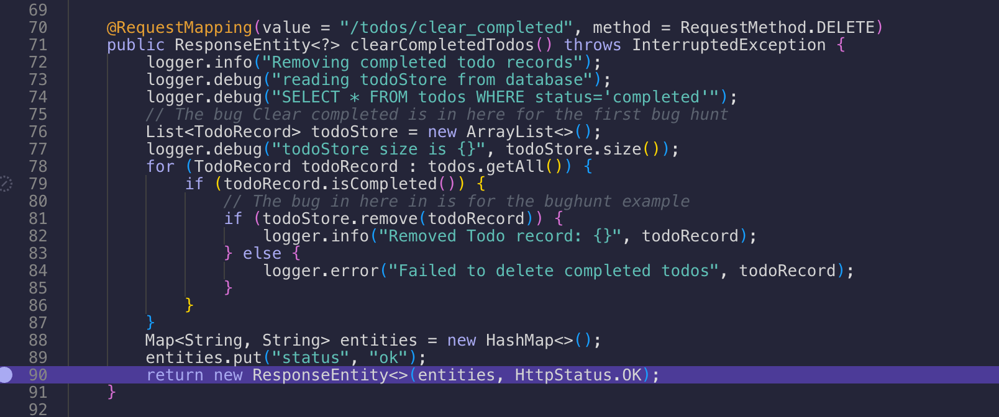
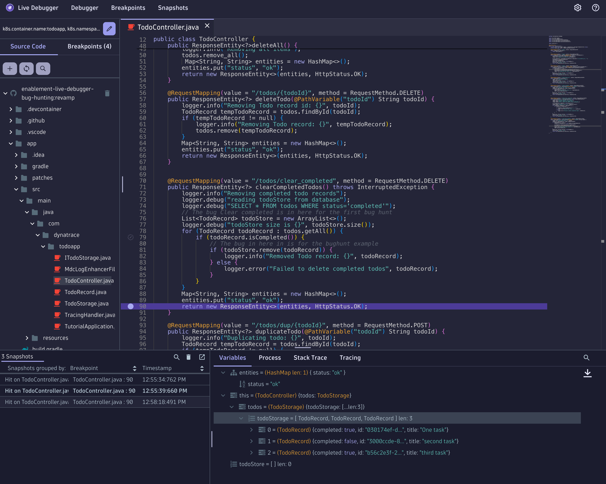

--8<-- "snippets/1-bug-hunt-via-k8s.js"

## Hunting via the kubernetes road

- Open the Kubernetes App > You'll see a cluster with the name "codespace-xxxx". That's your Kind cluster being fully observed.


- On the right hand side, click on Workloads, the Workloads Page will open. 

- Select the `todoapp`workload. 


- On the Overview in the right hand side, scroll down and open the `App Services` tab.  Dynatrace groups telemetry from distributed traces and spans into "Services" for you!



- Click on the TodoController service and then on the right corner `View Traces`


- This will open all the traces that went through your application... wow!

As you can see, there are traces with the name `clearCompletedTodos` that just took a couple ms and are not throwing any errors. The response code is 200, but since this is a bug it does not mean the application is working as expected.

This specific span it was just 2.98ms. On the right hand side, you can see the Tracing details, look how much data was captured automatically 🤩.




In the second node of the span, in the **Code Attributes** section, we can see the ``Code function: clearCompletedTodos`` and the ``Code Namespace: com.dynatrace.todoapp.TodoController`` 

Now we know which method and which package! Let's put our Developer Hat 🎩 and open the Live Debugger.

## Open Live Debugger

Type CTRL + K > Live Debugger for super fast access to the Live Debugger application. 

First we want to cuztomize our debuggin session to match the workloads where we want to set a non-breaking breakpoint. Click on the pencil icon to "Customize your debug session" so we can add the filters ``namespace:todoapp`` ``k8s.workload.name:todoapp``. This information was also available in the trace that we just took a look at. There are multiple filters you can add, important here is to have a filter that can be reused and is not specifc to an instance in case the pods a recycled and you want to make sure you are always setting breakpoints to a specific workload in a specific cluster (or multiple).


## Connect the Github repository (manually)

Once you click next, no repository was found for this application (this is because no repo was configured). Let's add it manually.

- Click on the + sign to add a new one


- Click on authenticate. It'll open a window where you'll authenticate with your GitHub personal account.

Why? we take security very seriously, meaning the source code will never leave the browser, the client. 


- In organisation you enter: ``dynatrace-wwse``
- In Repository you enter this repo: ``enablement-live-debugger-bug-hunting``


- Click on Done!

Now you are all set! you should see an  image like this:


## Navigate to the TodoController.java

You have multiple ways to open the TodoController.java. Let's say you know the code, then easily you'll navigate to it by opening the Source Code menu on the left pane, navigate to: ``todoapp > src > main > java > com > dynatrace > todoapp > TodoController.java``


if you don't know the structure, use the search and type ``TodoController``it'll search for all matches, you'll see the Class file so you can open it.


Now let's search for the Method ``clearCompletedTodos``. You'll find the Method definition at line 72. 

> `70` @RequestMapping(value = "/todos/clear_completed", method = RequestMethod.DELETE)
> `71` public ResponseEntity<?> clearCompletedTodos() throws InterruptedException {

We need to set a non-breaking breakpoint on running code inside the method, for this I recommend to start setting it on the ``return`` code which is at line 90. This way we gather all the values of the variables inside the method before the process ends and the return code is sent back to the client.

> `90` return new ResponseEntity<>(entities, HttpStatus.OK);

You can set a non-breaking breakpoint by clicking just to the left of the line number.  Set it and wait for the status to change to **Active**.



Go back to the TODO app and clear again on "Clear completed"

Return to the Live Debugger and see the Snaphot captured, open it and see all the variables that were captured with their values.



Do you see the bug? can you understand what happened and why the completed todos are not deleted? We can see two variables, the ``todos`` with a length of 3 and ``todoStore`` with a length of 0.

!!! example ""
    In line 81 ``todoStore.remove(todoRecord)`` the variable todoStore is a newly instantiated variable. The developer forgot that the persistence layer gives an array automatically and does not need to create a new array. This is a mistake, it should be replaced by the variable ``todos`` so the function can succesfully remove all cleared tasks!


Yay! we found the first bug!!!

!!! tip "Seeing is believing 🤩"
    Did you notice? With Dynatrace we were able to navigate from the Kubernetes Cluster all the way down to the workload, it's traces cotinuing down to the specific method and namespace of the called function and variables. With one click on the method we were able to set a **non-breaking** breakpoint in our production application deployed in a Kubernetes Cluster where with a single snapshot we were able to identify the bug. Debugging Kubernetes Clusters has never been so easy!!! And in Production!! 🤯


## Fixing the bug and redeploying the app

Open in VS Code the class ``TodoController.java`` and apply your changes. For compiling and redeploying the app we a have comfort function for you that does the compilation and the redeployment in kubernetes for you. Give it a try!

```bash
redeployApp
```

Is the bug gone? Open the app and verify it!

Yet, another way of verifying you succeeded is by typing: 

```bash
is_bug1_solved
```


??? example "Solution for the bug Clear Completed 🪲🛠️"

    Go to the terminal and type:
    
    ```bash
    solve_bug1
    ```

    This function will implement the bugfix from branch `solution/bug1`. 
    The function checkouts the code from `solution/bug1`, compiles the code and redeploys it into the Kubernetes cluster.

    <br>
    <details>
    <summary>🛠️ The code changes </summary>


    The `TodoController.clearCompletedTodos` you just need to change one variable, replace `todoStore` to `todos` in the if clause on line 81.
    
    ```javascript
       
                if (todosStore.remove(todoRecord)) {
               
    ```

    this way when iterating in the `todos` array, when the `todoRecord.isCompleted()` then we remove it from the correct list.
    
    ```javascript
      
                if (todos.remove(todoRecord)) {
            
    ```
    When the removal succeeds, then the correct log record will be printed out.


    </details>


    ??? question "Good to know about Version Control and Live Debugger"
        The `solve_bug1` function adds to the Kubernetes Deployment information to the Live Debugger where the source code resides. The solution is stored in the branch `solution/bug1`. 
        More on this in the section "Version Control" of this tutorial.


Verify the bug is gone! add more tasks and click on `clear completed` see how the tasks disappear gracefully now! Amazing!


<div class="grid cards" markdown>
- [Click here to continue the quest with the next Bug:octicons-arrow-right-24:](2-bug-special-characters.md)
</div>
