# Hunting via the Kubernetes road

- Open the **Kubernetes App** (CTRL + K, then type *Kubernetes*). You'll see your cluster being fully observed.

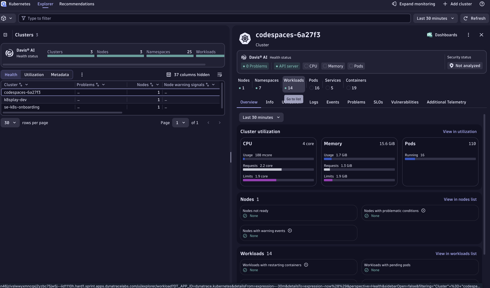

- On the right-hand side, click **Workloads** to open the Workloads page.
- Select the `todoapp` workload.

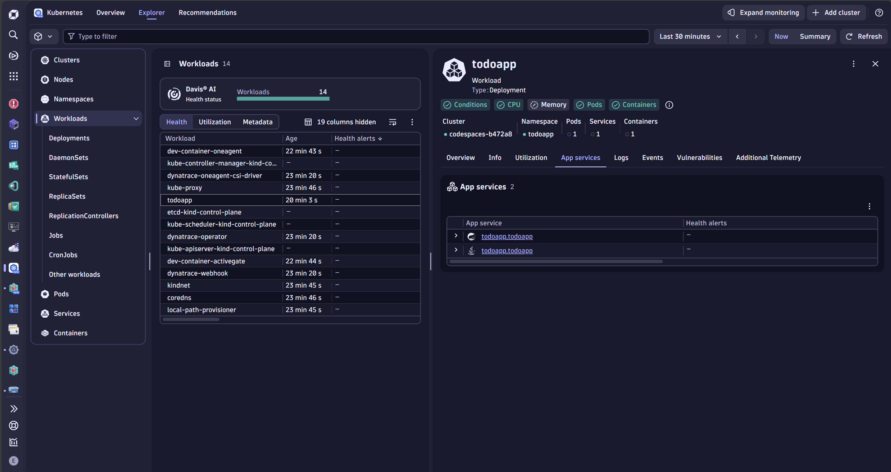

- On the Overview, scroll down and open the **App Services** tab. Dynatrace groups telemetry from distributed traces and spans into "Services" for you.

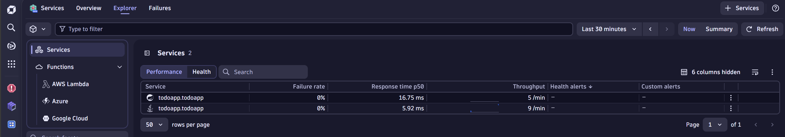

- Click the **TodoController** service, then **View Traces** in the top-right corner.

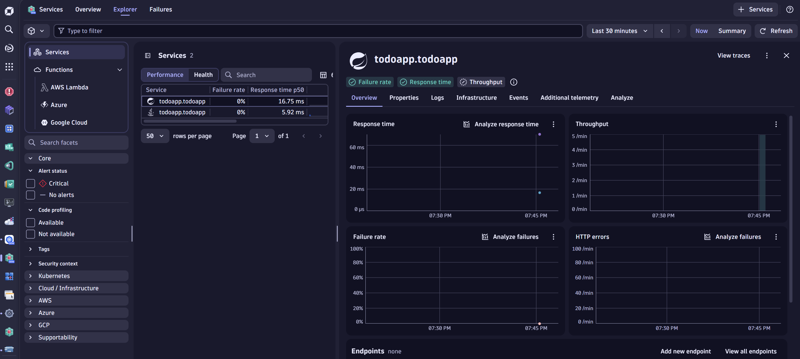

- This opens every trace that flowed through your application.

You'll see traces named `clearCompletedTodos` that took only a couple of milliseconds and throw no errors. The response code is **200** — but a 200 doesn't mean the app did what we wanted.

This particular span was just 2.98 ms. On the right, the tracing details show how much data was captured automatically 🤩.

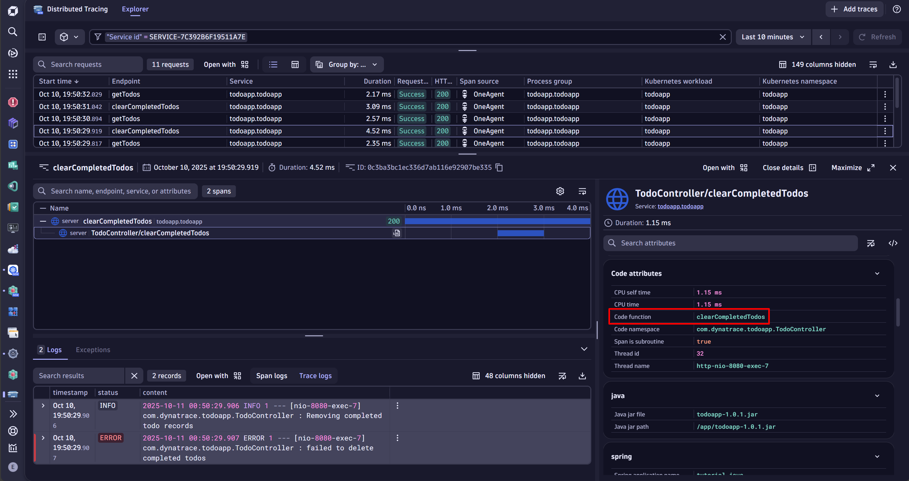

In the second span node, under **Code Attributes**, we see `Code function: clearCompletedTodos` and `Code Namespace: com.dynatrace.todoapp.TodoController`. Now we know exactly which method and package to debug. Let's open the Live Debugger.

Confirm Dynatrace captured the failed clear in the logs (the bug's fingerprint):

<!-- LAB_QUESTION
type: dql-verification
question: "Find the 'Failed to delete completed todos' evidence in the todoapp logs"
buttonText: "Find the evidence"
dql: |
  fetch logs
  | filter k8s.namespace.name == "todoapp"
  | filter matchesPhrase(content, "Failed to delete completed todos")
  | sort timestamp desc
  | limit 5
expect:
  operator: not-empty
hint: "Reproduce the bug first (add a completed task, click 'Clear completed'). Logs take 2–3 minutes to flow into Grail."
explanation: "Dynatrace captured the failed clear in the logs — the same code path we're about to debug live."
-->

## Open the Live Debugger

Type **CTRL + K > Live Debugger** for fast access.

First, customize your debug session to match the workload. Click the pencil icon (**Customize your debug session**) and add the filters `namespace:todoapp` and `k8s.workload.name:todoapp`. This info was also visible in the trace. Use reusable filters (not instance-specific ones) so breakpoints survive pod restarts and recycles.

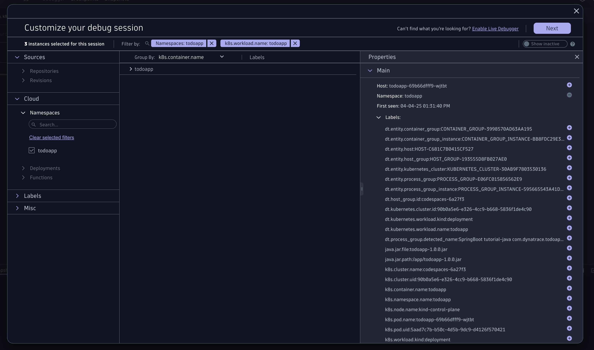

## Connect the GitHub repository (manually)

Once you click next, no repository is found for this application (none was configured). Add it manually:

- Click the **+** to add one.
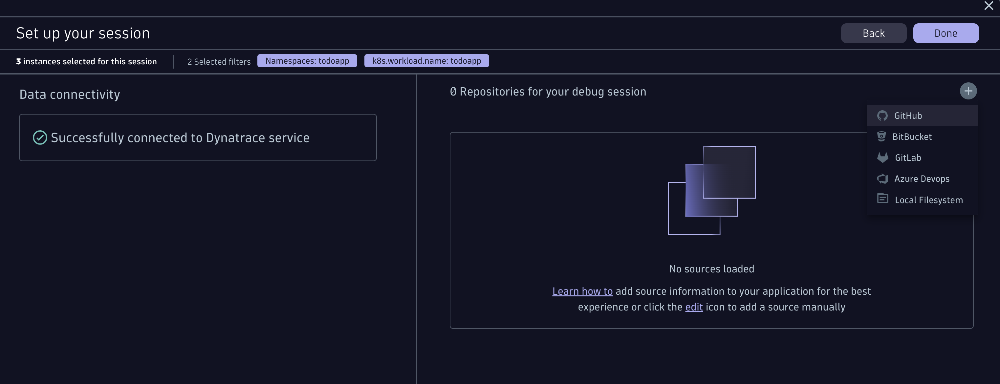

- Click **authenticate**. A window opens where you authenticate with your GitHub account. Why? We take security seriously — the source code never leaves the browser (the client).

- Organisation: `dynatrace-wwse`
- Repository: `enablement-live-debugger-bug-hunting`

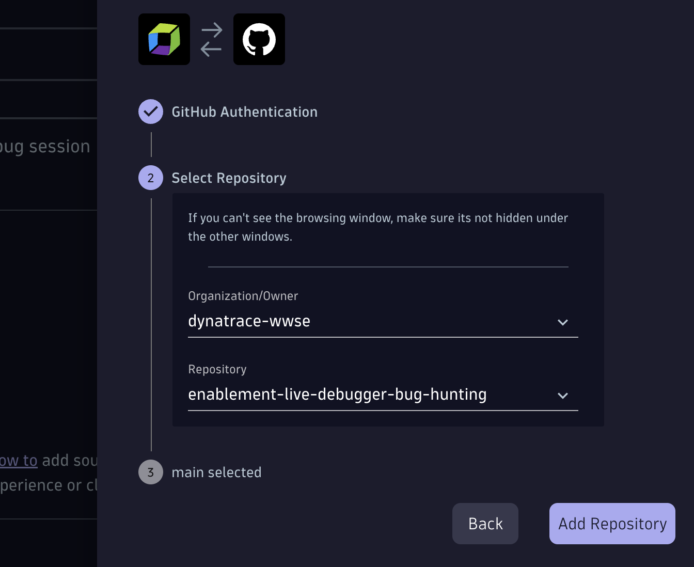

- Click **Done**. You should now see:

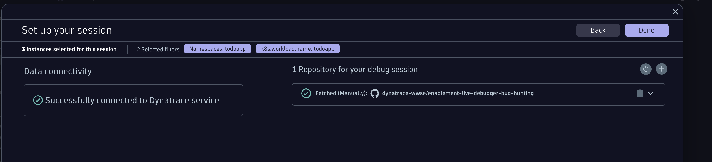

## Navigate to TodoController.java

Open the **Source Code** menu on the left and navigate to `todoapp > src > main > java > com > dynatrace > todoapp > TodoController.java`, or use search and type `TodoController`.

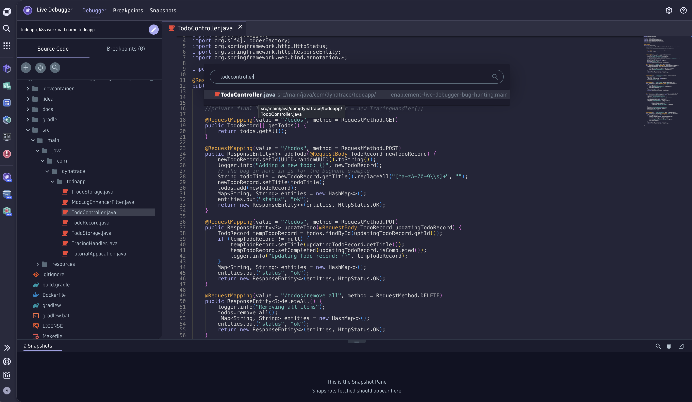

Find the `clearCompletedTodos` method (line 72):

> `70` @RequestMapping(value = "/todos/clear_completed", method = RequestMethod.DELETE)
> `71` public ResponseEntity<?> clearCompletedTodos() throws InterruptedException {

Set a **non-breaking breakpoint** on the `return` line (line 90) so we capture all variable values before the method returns:

> `90` return new ResponseEntity<>(entities, HttpStatus.OK);

Click just to the left of the line number, set it, and wait for the status to change to **Active**.

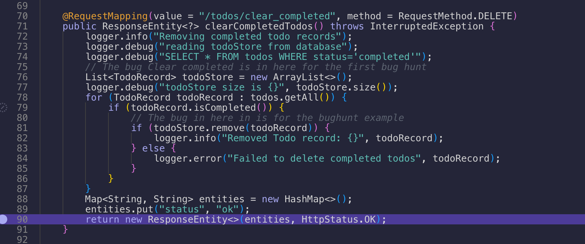

Go back to the TODO app and click **Clear completed** again. Return to the Live Debugger and open the captured **Snapshot** — inspect the variables and their values.

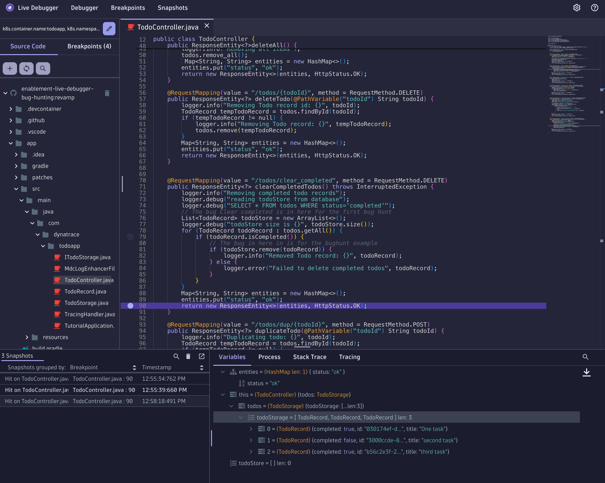

Do you see the bug? We can see two variables: `todos` with length 3 and `todoStore` with length 0.

!!! example ""
    On line 81, `todoStore.remove(todoRecord)` operates on a **newly instantiated** `todoStore`. The developer forgot that the persistence layer already provides the array — it should be `todos`. With `todoStore` empty, nothing is ever removed.

!!! tip "Seeing is believing 🤩"
    With Dynatrace we navigated from the Kubernetes cluster → workload → its traces → the exact method, namespace, and variables. One click set a **non-breaking** breakpoint in a production app on Kubernetes, and a single snapshot revealed the bug. In production!

<!-- LAB_QUESTION
type: multiple-choice
question: "The snapshot shows `todos` (length 3) and `todoStore` (length 0). Why are no todos removed?"
options:
  - "`remove` is called on `todoStore`, a freshly instantiated empty list, instead of `todos`, the list returned by the persistence layer"
  - "`todos` is null, so the loop never runs"
  - "The HTTP request was rejected with a 4xx status"
  - "The persistence layer is down"
correct: 0
explanation: "The handler mutates the wrong collection. `todoStore` is empty, so `remove` always returns false and the real `todos` list is never touched — yet the request still returns 200."
-->

## Fix the bug and redeploy

Open `TodoController.java`, apply your change, then compile and redeploy with the helper function:

```bash
redeployApp
```

Then verify the bug is gone — add tasks, complete them, and click **Clear completed**:

<!-- LAB_QUESTION
type: shell-verification
question: "Verify the 'Clear completed' bug is fixed"
buttonText: "Check Bug 1 is solved"
command: "source .devcontainer/util/source_framework.sh >/dev/null 2>&1 && is_bug1_solved"
expect:
  operator: exit-zero
hint: "Edit line 81 of TodoController.java to remove from `todos` (not `todoStore`), then run `redeployApp`. The check adds a completed task, clears it, and confirms the removal was logged."
explanation: "✅ Bug 'Clear completed' is gone — completed todos are now removed correctly."
-->

<!-- LAB_SOLUTION
reveal: |
  In `TodoController.clearCompletedTodos`, change line 81 to remove from the
  persistence-backed list `todos` instead of the empty `todoStore`:

  ```java
  // before
  if (todoStore.remove(todoRecord)) {
  // after
  if (todos.remove(todoRecord)) {
  ```

  Then run `redeployApp`. The "Run solution" button applies the fix from the
  `solution/bug1` branch (compile + redeploy) and confirms it with
  `is_bug1_solved`. The branch also wires the Live Debugger version-control env
  vars — see the *Version Control* section.
commands:
  - solve_bug1
verify:
  - is_bug1_solved
-->

Verify the bug is gone — add more tasks, click **Clear completed**, and watch them disappear gracefully. Amazing!

<div class="grid cards" markdown>
- [Continue the quest with the next Bug :octicons-arrow-right-24:](2-bug-special-characters.md)
</div>
