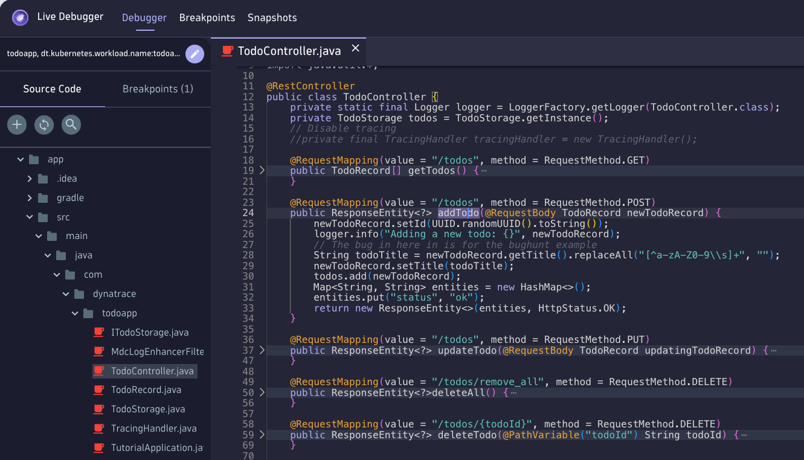
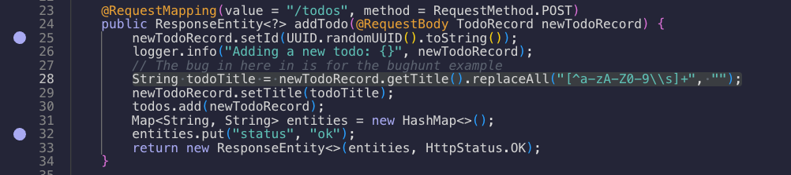

--8<-- "snippets/2-bug-hunt-via-tracing.js"

## Open the Distributed Tracing App
!!! Tipp "Protip: Open the Tracing App anywhere in Dynatrace"
    Type CTRL + K, then search for 'Tracing'. The Tracing App should appear in the Super Search.
    

!!! Tipp "Want to learn more about the Tracing App?"
    If you want to learn more about the [new Distributed Tracing App, watch this amazing 12 min recording of Dynatrace App Spotlights](https://www.youtube.com/watch?v=O4zWlwJ4hsA){target="_blank"}

In the filter add:

```text
"Kubernetes namespace" = todoapp AND "Kubernetes workload" = todoapp
```

You can also let the autocomplete help you or use the facets on the left-hand side to filter for all requests of the Pod `todoapp` that is deployed in the namespace `todoapp`.


If we take a look at the traces, we can see there is a trace named `addTodo`. By opening this trace, in the details pane on the right-hand side, we can see in the `Code Attributes` that the `Code function = addTodo` and the `Code Namespace = com.dynatrace.todoapp.TodoController`

Now we know where in the application code we should be looking for the bug!

## Open the Live Debugger

- Let's search for the `Code function = addTodo` under the `Code Namespace = com.dynatrace.todoapp.TodoController`. In the search,  type `TodoController` the class file appears, open it.
- Now let's search for the `AddTodo` function, the declaration is in line 24.



Notice anything unusual? The developer left a String function on line 28:

> `28` String todoTitle = newTodoRecord.getTitle().replaceAll("[^a-zA-Z0-9\\s]+", "");

- Let's add two breakpoints around that line, one before, let's say on line 25 and another on line 32.



- Go to the TodoApp in your browser and add a Task with a special character.

Task:
```text
This is exciting!!!
```

- Go back to the Live Debugger and watch the two snapshots, snapshots get gathered in real time.


- If you open the first snapshot, the one on line 25, you'll notice the Object `newTodoRecord.title = This is exciting!!!` that contains the exclamation mark. Meaning the data is being correctly passed on to the function `addTodo`, but then something happens and the `!!!` are removed.
- If you then look for the same attribute in the same method on the second snapshot you'll see that the `!!!` are gone.

## Watching variables
- We want to make your life as a developer easier. With the Live Debugger you can watch variables, right click on the  `newTodoRecord.title` and select `Watch`


- You'll see that in the snapshots, the title variable captured in both snapshots are added for ease of debugging complex applications. This is a very simple app, but imagine you have hundreds or thousands of lines of code, not all of them written by you, using this strategy you can understand how specific variables change through the code.


!!! example "Fix the bug 🪲🛠️"
    Go back to your Codespace and find the source code for the `TodoController`. It should be under the following path: `app/src/main/java/com/dynatrace/todoapp/TodoController.java`. Once you apply the fix, run the following commands:

    ```bash
    cd /workspaces/enablement-live-debugger-bug-hunting
    chmod +x redeploy-todoapp.sh
    ./redeploy-todoapp.sh
    ```
<br>
<details>
<summary>💡 Hint</summary>

Before
```javascript
String todoTitle = newTodoRecord.getTitle().replaceAll("[^a-zA-Z0-9\\s]+", "");
newTodoRecord.setTitle(todoTitle);
```

After
```javascript
//String todoTitle = newTodoRecord.getTitle().replaceAll("[^a-zA-Z0-9\\s]+", "");
String todoTitle = newTodoRecord.getTitle();
newTodoRecord.setTitle(todoTitle);
```
</details> 
<br>

<div class="grid cards" markdown>
- [Click here to continue the quest with the next Bug:octicons-arrow-right-24:](3-bug-duplicate-task.md)
</div>
