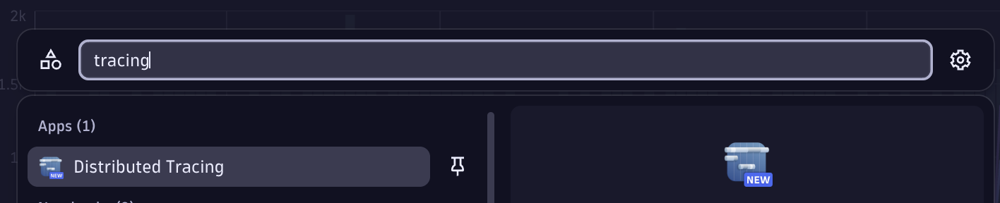
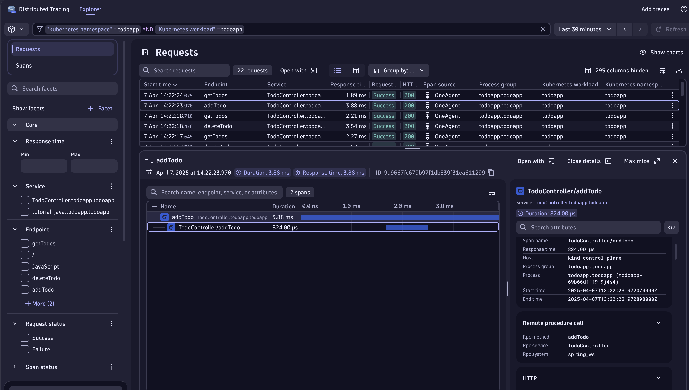
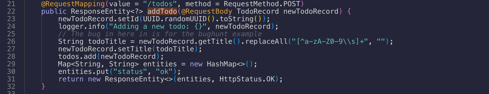
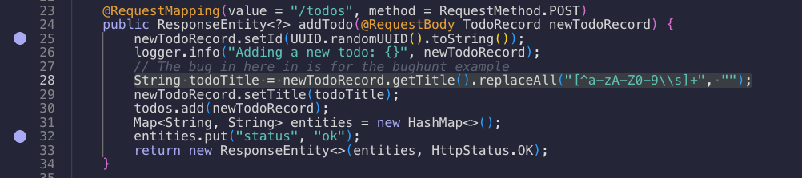
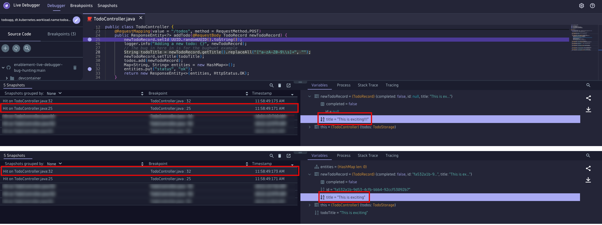
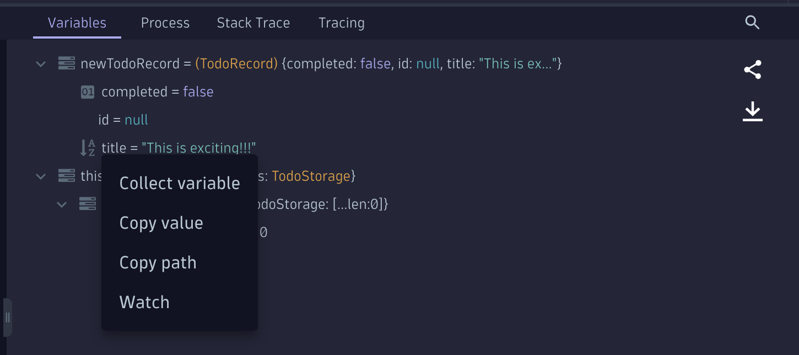
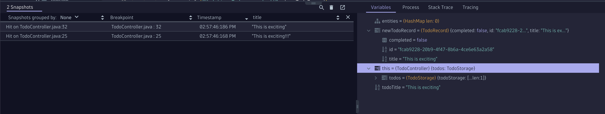

# Hunting via Distributed Traces

## Open the Distributed Tracing App

!!! tip "Protip: open the Tracing App anywhere in Dynatrace"
    Type **CTRL + K**, then search for *Tracing*. The Tracing App appears in the Super Search.
    

!!! tip "Want to learn more about the Tracing App?"
    Watch this [12-minute Dynatrace App Spotlight on the Distributed Tracing App](https://www.youtube.com/watch?v=O4zWlwJ4hsA){target="_blank"}.

In the filter, add:

```text
"Kubernetes namespace" = todoapp AND "Kubernetes workload" = todoapp
```

You can let autocomplete help, or use the facets on the left to filter all requests of the `todoapp` pod in the `todoapp` namespace.



Look for a trace named `addTodo`. Open it; in the details pane on the right, the **Code Attributes** show `Code function = addTodo` and `Code Namespace = com.dynatrace.todoapp.TodoController`. Now we know where to look.

<!-- LAB_QUESTION
type: dql-verification
question: "Confirm Dynatrace captured the addTodo activity for todoapp"
buttonText: "Find addTodo logs"
dql: |
  fetch logs
  | filter k8s.namespace.name == "todoapp"
  | filter matchesPhrase(content, "Adding a new todo")
  | sort timestamp desc
  | limit 5
expect:
  operator: not-empty
hint: "Add a task in the TODO app first, then wait 2–3 minutes for logs to flow into Grail."
explanation: "Dynatrace captured the addTodo calls — the exact code path that rewrites the title."
-->

## Open the Live Debugger

- Search for `Code function = addTodo` under `Code Namespace = com.dynatrace.todoapp.TodoController`. In search, type `TodoController` and open the class.
- Find the `addTodo` function — the declaration is at line 22.



Notice anything unusual? The developer left a string transformation on line 26:

> `26` String todoTitle = newTodoRecord.getTitle().replaceAll("[^a-zA-Z0-9\\s]+", "");

- Set two non-breaking breakpoints around that line — one **before** (line 23) and one **after** (line 30).



- Go to the TODO app and add a task with special characters:

```text
This is exciting!!!
```

- Return to the Live Debugger and watch the two snapshots arrive in real time.



- Open the first snapshot (line 23): `newTodoRecord.title = This is exciting!!!` — the `!!!` are present. The data arrives intact.
- Open the second snapshot (line 30): the `!!!` are **gone**. The transformation in between stripped them.

## Watching variables

The Live Debugger lets you **watch** a variable and see it change. Right-click `newTodoRecord.title` and select **Watch**.



The watched title now appears in both snapshots side by side. In a simple app this is obvious — but across thousands of lines you didn't write, watching a variable through the code is how you understand exactly where it mutates.



<!-- LAB_QUESTION
type: multiple-choice
question: "The before/after snapshots show the title intact at line 23 and stripped at line 30. What is the fix?"
options:
  - "Remove (or comment out) the `replaceAll(...)` sanitisation so the original title is stored unchanged"
  - "Add more characters to the regex allow-list one by one"
  - "Move the breakpoint to a different line"
  - "Increase the pod's memory limit"
correct: 0
explanation: "The leftover regex sanitisation is the bug. The title should be stored as entered, so the `replaceAll` line (and the matching `setTitle`) are removed."
-->

## Fix the bug and redeploy

Open `TodoController.java`, apply your change, then:

```bash
redeployApp
```

Add a task with special characters and confirm they're preserved:

<!-- LAB_QUESTION
type: shell-verification
question: "Verify the 'Special characters' bug is fixed"
buttonText: "Check Bug 2 is solved"
command: "source .devcontainer/util/source_framework.sh >/dev/null 2>&1 && is_bug2_solved"
expect:
  operator: exit-zero
hint: "Comment out the `replaceAll(...)` line (and the following `setTitle`) in `addTodo`, then run `redeployApp`. The check adds `Exciting validation!?#` and confirms the title is preserved."
explanation: "✅ Bug 'Special characters' is gone — titles keep their special characters."
-->

<!-- LAB_SOLUTION
reveal: |
  In `TodoController.addTodo`, the title should be stored as entered. Comment out
  the leftover sanitisation:

  ```java
  newTodoRecord.setId(UUID.randomUUID().toString());
  logger.info("Adding a new todo: {}", newTodoRecord);
  // String todoTitle = newTodoRecord.getTitle().replaceAll("[^a-zA-Z0-9\\s]+", "");
  // newTodoRecord.setTitle(todoTitle);
  todos.add(newTodoRecord);
  ```

  Then run `redeployApp`. The "Run solution" button applies the fix from the
  `solution/bug2` branch and confirms it with `is_bug2_solved`.
commands:
  - solve_bug2
verify:
  - is_bug2_solved
-->

<div class="grid cards" markdown>
- [Continue the quest with the next Bug :octicons-arrow-right-24:](3-bug-duplicate-task.md)
</div>
