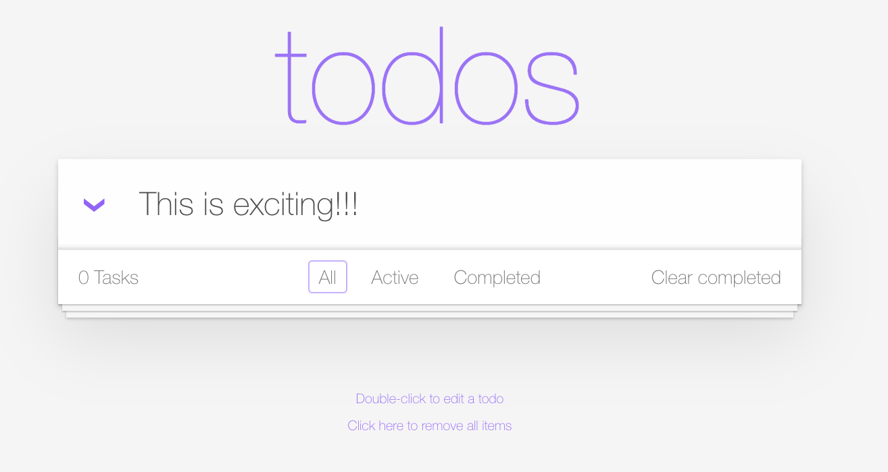
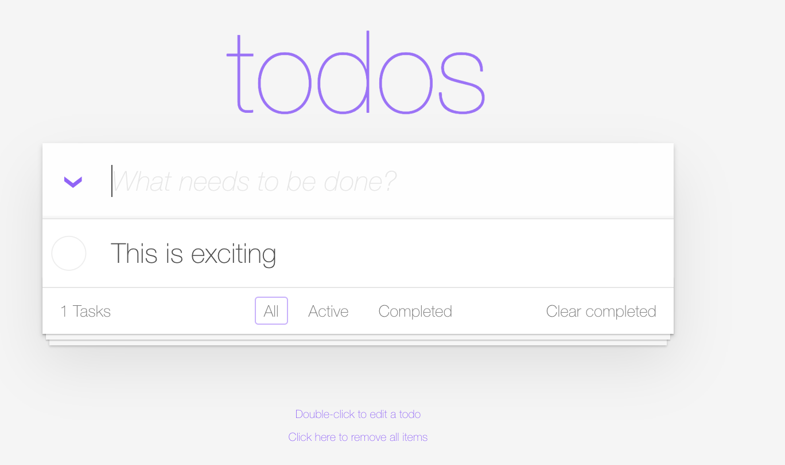

<!-- STEP_SETUP
commands:
  - "addTask '{\"title\":\"Exciting validation!?#\",\"completed\":false}'"
-->

!!! note "The Bug — 'Special characters'"
    Level: Beginner

## Reproduce the bug

Open the TODO app and add a task that contains a special character — for example an exclamation mark `!`:

Press **ENTER** to add it:

What happened? The special characters were **stripped** from the title. (We also added one such task — `Exciting validation!?#` — for you in the background so Dynatrace has data to hunt.) Why are the signs disappearing?

<!-- LAB_QUESTION
type: multiple-choice
question: "You typed `Exciting validation!?#` and the stored title became `Exciting validation`. Where is the most likely culprit?"
options:
  - "A string transformation inside the `addTodo` handler is sanitising the title before it is stored"
  - "The browser is blocking special characters before they are sent"
  - "Kubernetes is rewriting the HTTP request body"
  - "Dynatrace removed the characters during log ingestion"
correct: 0
explanation: "The data leaves the browser intact, so the change must happen server-side. A regex/replace in the `addTodo` method is rewriting the title — exactly what the Live Debugger will show us, variable by variable."
-->

Let's keep hunting. Imagine you're a brand-new developer on the TODO app team — how hard would it be to find which pod, namespace, and line of code is responsible? With Dynatrace, not hard at all. This time we'll go straight to the **Distributed Tracing** app.

- [Hunt the bug via Distributed Traces :octicons-arrow-right-24:](2-bug-hunt-via-tracing.md)

