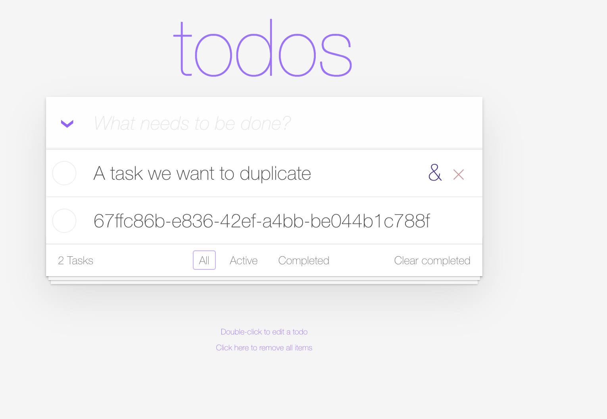
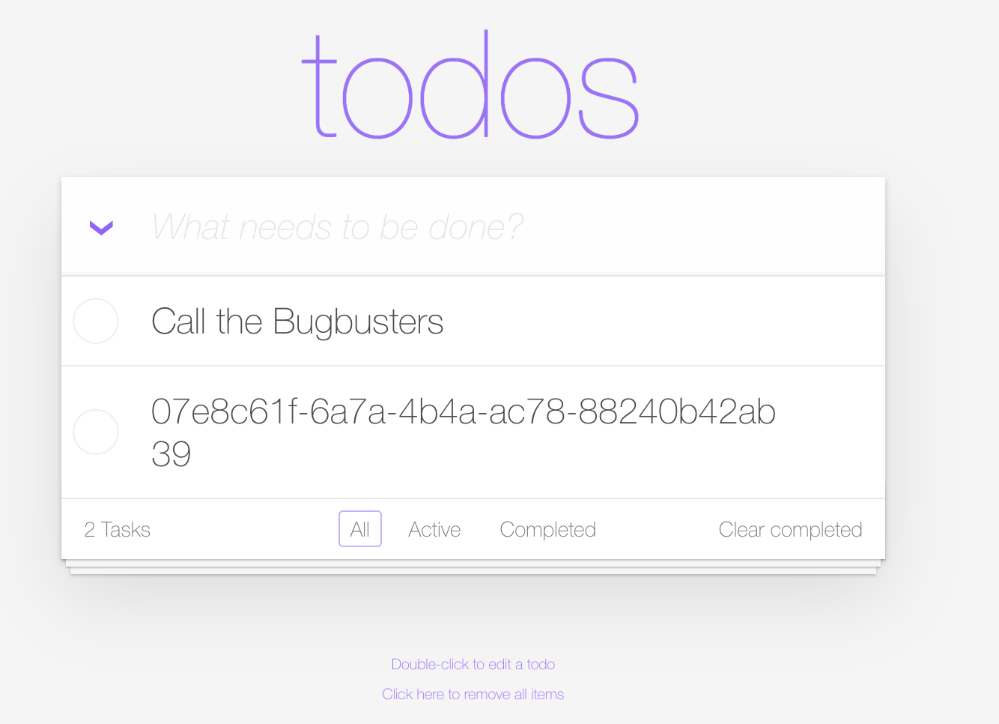

<!-- STEP_SETUP
commands:
  - "addTask '{\"title\":\"Call the Bugbusters\",\"completed\":false}'"
-->

!!! note "The Bug — 'Duplicate task'"
    Level: Intermediate

## Reproduce the bug

The TODO app has a **duplicate** function. Let's try it.

- Add a task you want to duplicate — we'll use **Call the Bugbusters** (we also added it for you in the background):

```text
Call the Bugbusters
```



- Hover over the task and click the **&** symbol on the right to duplicate it.



What happened? A new task was created — but instead of a clean duplicate we see a weird string that looks like an ID where the title should be.

<!-- LAB_QUESTION
type: multiple-choice
question: "The duplicate shows an ID where the title should be (and vice-versa). What kind of bug is this most likely to be?"
options:
  - "Two setter calls have their arguments swapped — the title is set to a new UUID and the ID is set to the old title"
  - "The database rejected the insert"
  - "The browser cached an old copy of the task"
  - "Dynatrace mislabeled the log line"
correct: 0
explanation: "Swapped values are the classic signature of swapped setter arguments. The Live Debugger snapshot will show the map items with title and ID transposed."
-->

Let's continue the bug-hunting quest — this time starting from the **Logs** app.

<div class="grid cards" markdown>
- [Hunt the bug via Logs :octicons-arrow-right-24:](3-bug-hunt-via-logs.md)
</div>
