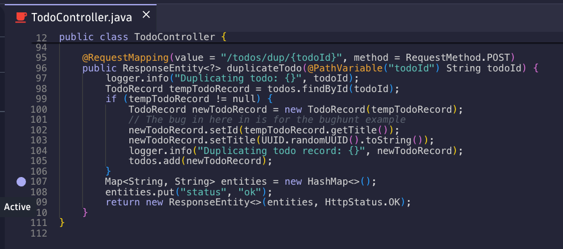
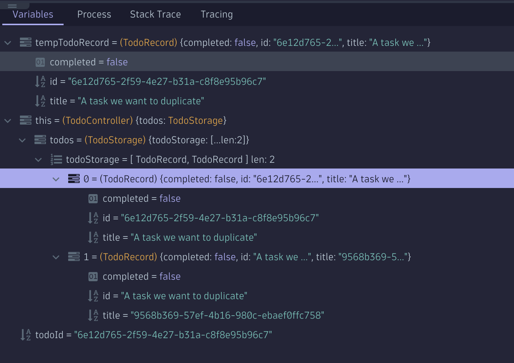
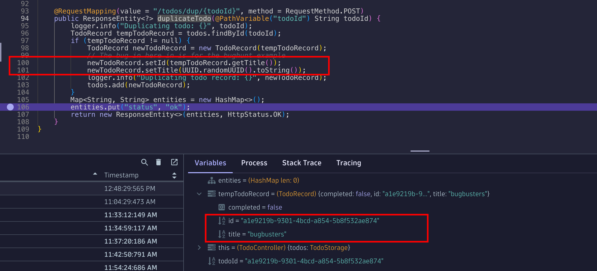

--8<-- "snippets/3-bug-hunt-via-logs.js"

## Hunting road - Logs App
We have seen how easy it is to find the traces via the Distributed Tracing App, now let's try a different approach. Let's find the trace, it's method and codespace via the Logs App. The Dynatrace Platform is context aware, it knows which traces write which logs, from which pod they are coming from and even which user generated the transaction.

- Open the Logs App. Again let's be a pro and type CTRL + K and then type in Logs, the Logs App should appear in the super search.
- In the filter, type the content or part of the content of the Task, `Call the Bugbusters`. I'm assuming the developers is logging the content I'm writing in the app since "we don't know the code" and in our quests we are searching via logs. Let's see if we are lucky.

Filter:
```text
content=*bugbusters*
```


Wow, that was fast, we see two log entries with that match and are coming from the same pod. One was adding the task, the other duplicating it.

From the `content` if you look carefully, you can see that the duplicate has the ID and title swapped.


To view the related distributed trace, we can either:
- Right click on the Log line and **open record with** and you select the **Distributed Tracing** app
- On the right details pane, above the Topology section of the Log entry, there is a button for your convenience that says **Open trace**


## Hunting road - Distributed Tracing App 

!!! Note "Via the Distributed Tracing app"
    In case you want to skip searching the Trace via the log entries, here is how to find it only via traces:

    - In the filter add `"Kubernetes namespace" = todoapp AND "Kubernetes workload" = todoapp`
    
    - See the incoming requests, you'll notice one with the name `duplicateTodo`

- The trace has the `Code function = duplicateTodo` and the `Code Namespace = com.dynatrace.todoapp.TodoController`

- Now that we have the trace, we can notice that it has also a HTTP Status Code of 200, meaning there are no failures, but the app does not work as we want it to work. Let's debug the function!

## Open the Live Debugger

- Let's search for the `Code function = duplicateTodo` under the `Code Namespace = com.dynatrace.todoapp.TodoController`. In the search,  type `TodoController` the class file appears, open it.
- Now let's search for the `duplicateTodo` function, the declaration is in line 95.
- Let's put a non-breaking breakpoint on line 107



- Go to the Todo app and repeat the bug.
- Return to the Live Debugger session and click on the new snapshot.  Review the variables.



Did you notice how the Map has in the items [0] and [1] the title and UUIDs are swapped?

Looking at the source code, in lines 102 and 103, the variables are incorrectly set because the functions are swapped! 



Now the developer can easily fix this code and resolve the issue!

We've now successfully hunted down and taken care of another bug 🤩

!!! example "Fix the bug 🪲🛠️"
    Go back to your Codespace and find the source code for the `TodoController`. It should be under the following path: `app/src/main/java/com/dynatrace/todoapp/TodoController.java`. Once you apply the fix, run the following commands:

    ```bash
    cd /workspaces/enablement-live-debugger-bug-hunting
    chmod +x redeploy-todoapp.sh
    ./redeploy-todoapp.sh
    ```
<br>
<details>
<summary>💡 Hint</summary>

Before
```javascript
newTodoRecord.setId(tempTodoRecord.getTitle());
newTodoRecord.setTitle(UUID.randomUUID().toString());
```

After
```javascript
newTodoRecord.setId(UUID.randomUUID().toString());
newTodoRecord.setTitle(tempTodoRecord.getTitle());
```
</details> 
<br>

<div class="grid cards" markdown>
- [Click here to continue :octicons-arrow-right-24:](ide-integration.md)
</div>
