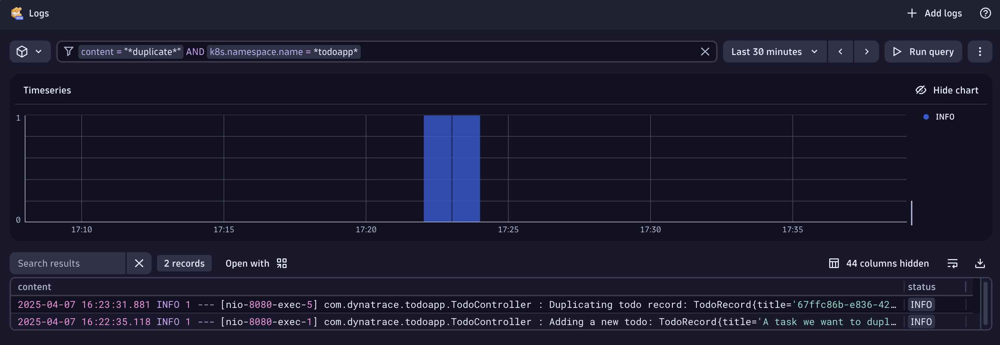
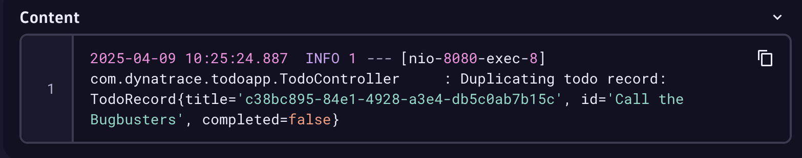
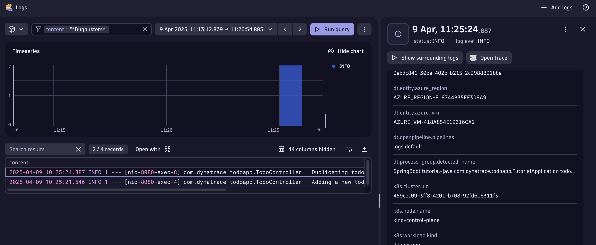
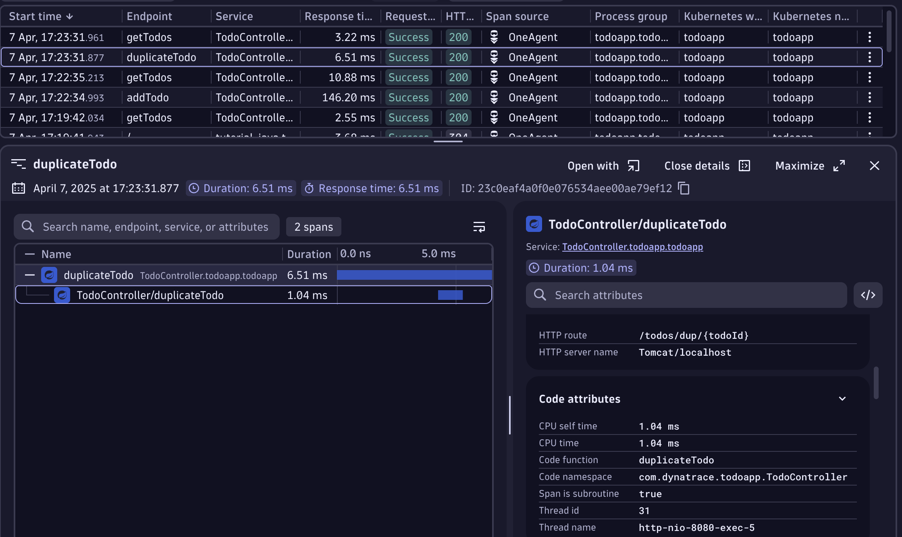
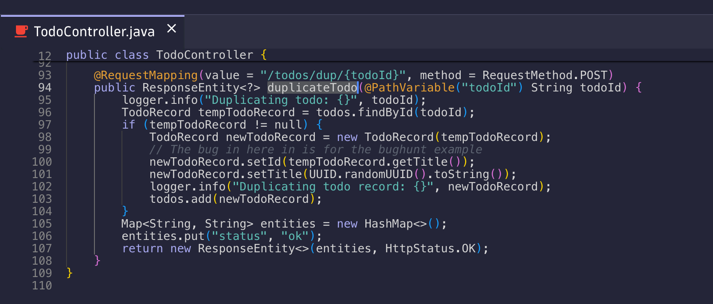
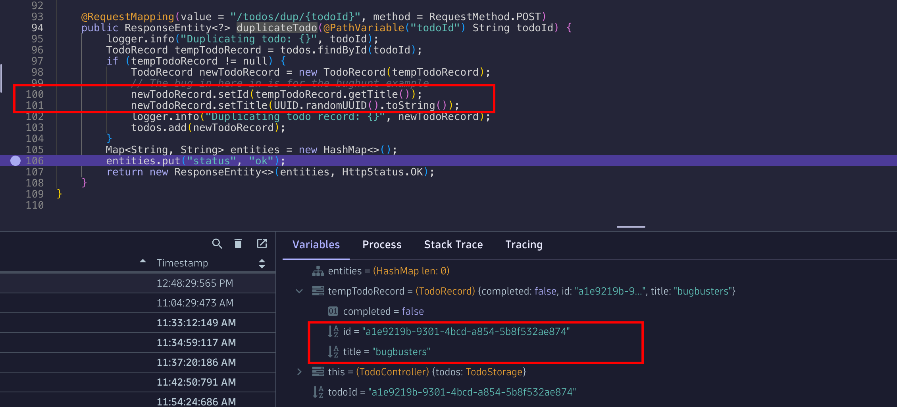

# Hunting via the Logs App

We saw how easy it is to find traces in the Distributed Tracing app. Now let's try a different angle: find the trace, its method, and its code via the **Logs** app. The Dynatrace Platform is context-aware — it knows which traces write which logs, from which pod, and even which user generated the transaction.

- Open the **Logs App** (CTRL + K, then type *Logs*).
- Filter on part of the task content, `Call the Bugbusters`. We're assuming the developer logs the content the user types — and since "we don't know the code", we hunt via logs:

```text
content=*bugbusters*
```



Two log entries match, from the same pod — one added the task, the other duplicated it.

Look closely at the `content`: the duplicate has the **ID and title swapped**.



To jump to the related distributed trace, either:

- Right-click the log line → **Open record with** → **Distributed Tracing**, or
- Use the **Open trace** button above the Topology section in the details pane.



<!-- LAB_QUESTION
type: dql-verification
question: "Find the 'Call the Bugbusters' duplicate activity in the todoapp logs"
buttonText: "Find the logs"
dql: |
  fetch logs
  | filter k8s.namespace.name == "todoapp"
  | filter matchesPhrase(content, "Bugbusters")
  | sort timestamp desc
  | limit 5
expect:
  operator: not-empty
hint: "Add and duplicate a task named 'Call the Bugbusters' first, then wait 2–3 minutes for logs to reach Grail."
explanation: "Dynatrace correlated the add and duplicate log lines — and links each straight to its trace and code."
-->

## Hunting road — Distributed Tracing App

!!! note "Via the Distributed Tracing app"
    To find the trace directly (skipping logs):

    - Filter: `"Kubernetes namespace" = todoapp AND "Kubernetes workload" = todoapp`
    
    - Look for an incoming request named `duplicateTodo`.

- The trace has `Code function = duplicateTodo` and `Code Namespace = com.dynatrace.todoapp.TodoController`.
- Notice the HTTP status is **200** — no failures — yet the app misbehaves. Let's debug the function.

## Open the Live Debugger

- Search for `Code function = duplicateTodo` under `Code Namespace = com.dynatrace.todoapp.TodoController` (type `TodoController` in search and open the class).
- Find the `duplicateTodo` function — declared at line 94.



- Set a non-breaking breakpoint on line 106.
- Go to the TODO app and reproduce the bug (duplicate a task).
- Return to the Live Debugger and open the new snapshot. Review the variables.

Notice how the map items `[0]` and `[1]` have their title and UUID **swapped**? Looking at lines 100 and 101, the setters are assigning the wrong values to each other.



Now the developer can fix the code and resolve the issue. Another bug hunted down 🤩.

<!-- LAB_QUESTION
type: multiple-choice
question: "In `duplicateTodo`, the snapshot shows title and ID transposed on the new record. What is the correct fix?"
options:
  - "Generate a fresh UUID for the new ID and copy the original title — i.e. swap the two setter arguments back"
  - "Delete the original task after duplicating"
  - "Return a 500 status so the client retries"
  - "Disable the duplicate button"
correct: 0
explanation: "The duplicate must keep the title and get a new unique ID (the persistence layer needs unique IDs). The setters for ID and title were swapped; swapping them back fixes it."
-->

## Fix the bug and redeploy

Open `TodoController.java`, apply your change, then:

```bash
redeployApp
```

Duplicate a task and confirm the copy is correct:

<!-- LAB_QUESTION
type: shell-verification
question: "Verify the 'Duplicate task' bug is fixed"
buttonText: "Check Bug 3 is solved"
command: "source .devcontainer/util/source_framework.sh >/dev/null 2>&1 && is_bug3_solved"
expect:
  operator: exit-zero
hint: "Swap the setId/setTitle arguments in `duplicateTodo` (lines 100–101), then run `redeployApp`. The check adds a task, duplicates it, and verifies the title is preserved with a fresh ID."
explanation: "✅ Bug 'Duplicate task' is gone — duplicates keep the title and get a new unique ID."
-->

<!-- LAB_SOLUTION
reveal: |
  In `TodoController.duplicateTodo`, the ID and title setters were swapped.
  Swap them back so the duplicate keeps the title and gets a new unique ID:

  ```java
  // before
  newTodoRecord.setId(tempTodoRecord.getTitle());
  newTodoRecord.setTitle(UUID.randomUUID().toString());
  // after
  newTodoRecord.setId(UUID.randomUUID().toString());
  newTodoRecord.setTitle(tempTodoRecord.getTitle());
  ```

  Then run `redeployApp`. The "Run solution" button applies the fix from the
  `solution/bug3` branch and confirms it with `is_bug3_solved`.
commands:
  - solve_bug3
verify:
  - is_bug3_solved
-->

You've now hunted down all three bugs end to end. 🎉

<div class="grid cards" markdown>
- [Continue to Other Settings :octicons-arrow-right-24:](version-control.md)
</div>
