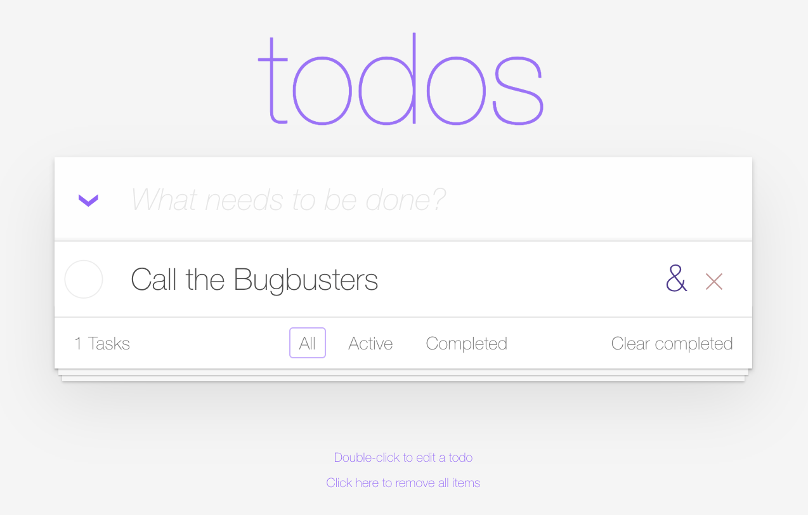
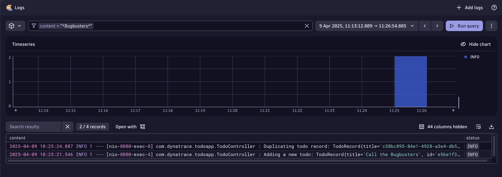
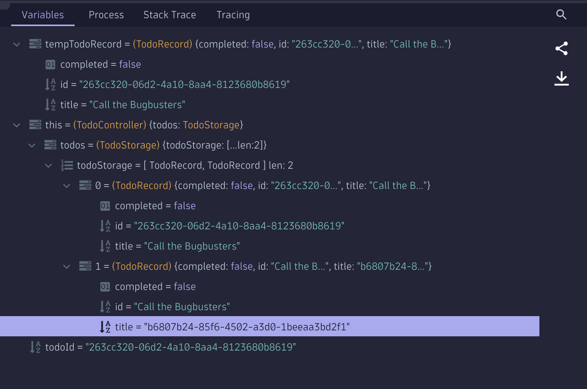

# The Bug "Duplicate Task"

!!! note "The Bug 'Duplicate Task'"
    Level: Intermediate

## Open the TODO App and add a Task

The TODO app has a duplicate function, let's give it a try.

- Add a Task that we want to duplicate.
- Hover over the added Task and on the right you'll notice a **&** symbol. This should duplicate the task.



What happened? 
We notice a new task was created, but instead of a duplicate we see a weird string, looks like an ID. 

Let's continue our Bug Hunting Quest!

## Hunting road - Logs App
Now let's try a different approach, we have seen how easy it is to find the traces via the Distributed Tracing App. Let's find the trace and it's method and codespace via the Logs App. The Dynatrace Plattform is context aware, it knows which traces write which logs, from which pod they are coming from and even which user generated the transaction. 

- Open the Logs App. Again let's be a pro and type CTRL + K and then Logs, the Logs App should appear in the super search.
- In the filter type the content or part of the content of the Task, in my case I wrote `A task we want to duplicate`, so I'm searching for `content=*duplicate*`.
- Since I'm monitoring multiple Kubernetes Clusters, I'm adding an extra filter for the `k8s.namespace.name = todoapp`. You can verify this by clicking on a log entry, and on the right hand side, the topology of the log entry will open, you'll notice is the same pod.



Wow, that was fast, we see two log entries with that match and are coming from the same pod. 

- We can either right click on the Log line and **open record with** and you select the **Distributed Tracing** app or on the right pane, above the Topology of the Log entry, there is a button for your convenience that says **Open trace**
- Either way will open the Distributed Tracing app


## Hunting road - Distributed Tracing App 

!!! Note "Via the Distributed Tracing app"
    In case you want to skip searching the Trace via the log entries, here is how to find it only via traces:

    - In the filter add `"Kubernetes namespace" = todoapp AND "Kubernetes workload" = todoapp`
    
    - See the incoming requests, you'll notice one with the name `duplicateTodo`

- The trace has the `Code function = duplicateTodo` and the `Code Namespace = com.dynatrace.todoapp.TodoController`

- Now that we have the trace, weather we found it via the Log entries or the traces, we can notice that it has also a HTTP Code 200, meaning there are no failures, but the app does not work as we want it to work. Let's debug the function!

## Open the Live Debugger

- Let's search for the `Code function = duplicateTodo` under the `Code Namespace = com.dynatrace.todoapp.TodoController`, in the search by typping `TodoController` the class file appears, open it.
- The declaration the of the `Code function = duplicateTodo` is in line 95.
- Let's put a non-breaking breakpoint on line 107
- Go to the Todo app and repeat the bug.



Did you notice how the Map has in the items [0] and [1] the title and UUIDs are swapped?

- This is also noticeable in the sourcecode, lines 102 and 103 are being swapped.

<!-- 
__Level: Intermediate__
- __The bug: Duplicate Todo adds an invalid todo instead of an exact copy of an existing one.__
    - **Reproduce:** Add a task and when hovering on the text, on the right side you have the **&** symbol. Click on it to duplicate the task.
    - **Debug:**
        1. In the Rookout app, open the file `src/main/java/com/rookout/tutorial/TodoController.java`
        2. Using the **Rules** pane on the right, select the *Rule Type* "Log"
        3. Add the rule in the duplicateTodo function on the line with `todos.add(newTodoRecord);`
        4. Before triggering the rule, let's edit it so it returns what we want
        5. In the **Rules** pane on the right, click the *Edit Rule* (pen) icon next to the rule you just added. It will open up the Rule configuration as a JSON file
        6. On line 37 in the `paths` object let's add a property `"store.rookout.locals.dup": "frame.newTodoRecord"`
        7. On line 51 we have `processing.operations` object, let's add a new operation in the array :
        __name: send_rookout - means we are sending the information to the rookout web application__
        __path: store.rookout.locals.dup - we tell the rule what information to send__

        ```
        {
            "name": "send_rookout",
            "path": "store.rookout.locals.dup"
        }
        ```
        8. Click the save button on the upper pane.
        9. Add and duplicate a todo in order to see the output, now we can see what is being given to the object and match if we have an error in the function (parameters missing or in bad order).
        
        


## Next steps

Head over to [our reference](reference-home.md) to understand all the Rookout components.   
See [our installation guides](installation-overview.md) for platform-specific installation examples.

-->

<div class="grid cards" markdown>
- [Click Here to Continue :octicons-arrow-right-24:](cleanup.md)
</div>
