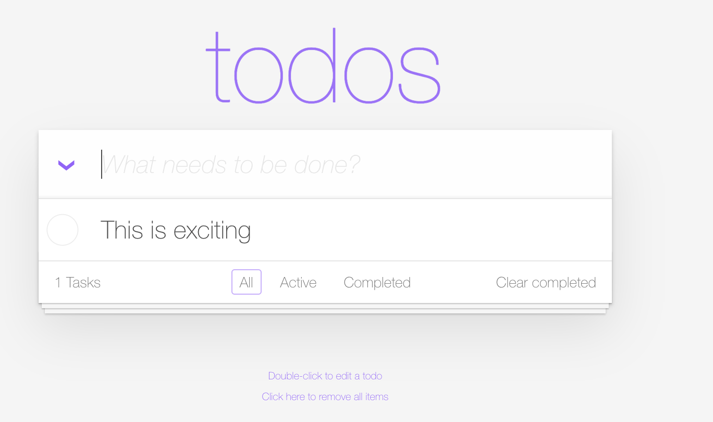
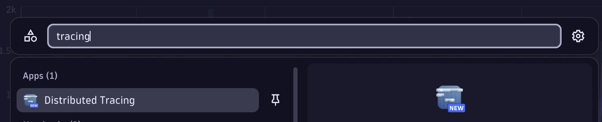
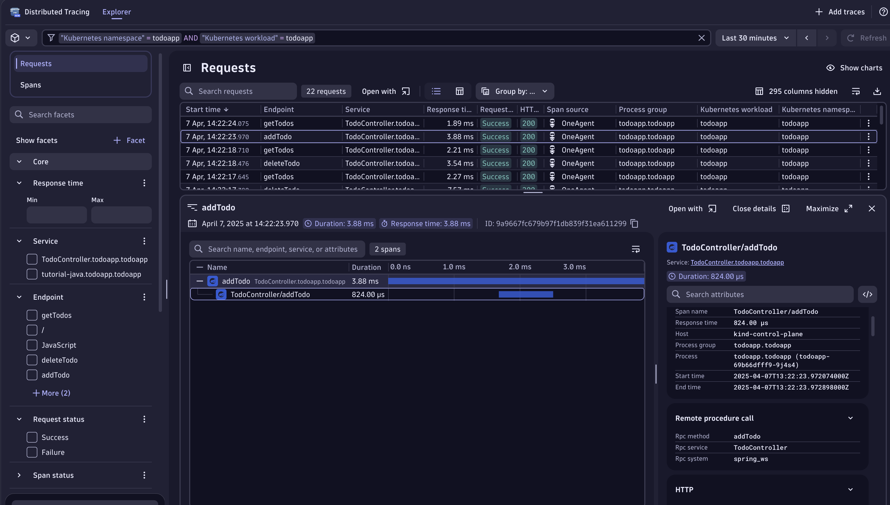
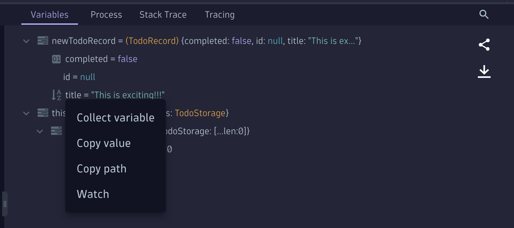
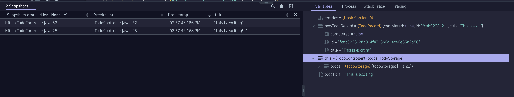

# The Bug "Special Characters"

!!! note "The Bug 'Clear Completed'"
    Level: Beginner

## Open the TODO App and add a Task with an exclamation mark!

- Add a task with an exclamation mark! or a special character for that matter, like this:

- Now type ENTER to add the task

- What happened? As you can see the signs are being removed. Why?

Let's continue with the bug hunting again! Now, let's assume we are new developers in the TODO app company. How difficult would it be to find the bug? To know where is the app running? which pod is delivering the requests? which namespace and line of code? Well, not with Dynatrace! We already learned how easy it was to find the TODO app within the Kubernetes App and from there we opened the traces in the Distributed Tracing app, so let's go there.

!!! Tipp "Want to learn more about the Tracing App?"
    If you want to learn more about the [new Distributed Tracing App, watch this amazing 12 min recording of Dynatrace App Spotlights](https://www.youtube.com/watch?v=O4zWlwJ4hsA){target="_blank"}

## Open the Distributed Tracing App
!!! Tipp "Protip: Open the Tracing App anywhere in Dynatrace"
    type CTRL + K and then Tracing, the tracing app should appear in the super search.
    

- In the filter add `"Kubernetes namespace" = todoapp AND "Kubernetes workload" = todoapp`

You can also let the autocomplete help you or use the facets on the left-hand side to filter for all requests of the POD `todoapp` that is deployed in the namespace `todoapp`.

If we take a look at the traces, we can see there is a trace named `addTodo`. By opening this trace, on the details on the right hand side, we can see in the `Code Attributes` that the `Code function = addTodo` and the `Code Namespace = com.dynatrace.todoapp.TodoController`

Now we know where in all the applications code we should be looking for the bug!

## Open Live Debugger

- Let's search for the `Code function = addTodo` under the `Code Namespace = com.dynatrace.todoapp.TodoController`, in the search by typping `TodoController` the class file appears, open it.
- Now let's search for the AddTodo function, the declaration is in line 24.

Do you see something weird? The deveoloper left a String function on line 28 with `getTitle().replaceAll("[^a-zA-Z0-9\\s]+", "");`

- Let's add two breakpoints around that line, one before, let's say on line 25 and another on line 32.
- Go to the TodoApp and add a Task with a special character. 
- Go back to the Live Debugger and watch the two snapshots get gathered on real time.
- If you open the first Hit, the one on line 25, you'll notice the Object `newTodoRecord.title = This is exciting!!!` that contains the exclamation mark. Meaning the data is being correctly passed on to the function ToDo, but then something happens and the `!!!` are removed.
- If you then look for the same attribute in the same method on the second HIT you'll see that the `!!!` are gone.

## Watching variables
- We want to make your life as a developer easier. With the Live Debugger you can watch varibles, right click on the  `newTodoRecord.title` and select `Watch`

- You'll see that in the snapshots, the title of both snapshots are added for ease of debugging complex applications. This is a very simple app, but imagine you have hundreds or thousend of lines of code, and are not even yours, using this strategy you can understand how specific variables change through the code.

- [Click Here to Continue the quest with the next Bug:octicons-arrow-right-24:](bug-special-characters.md)

