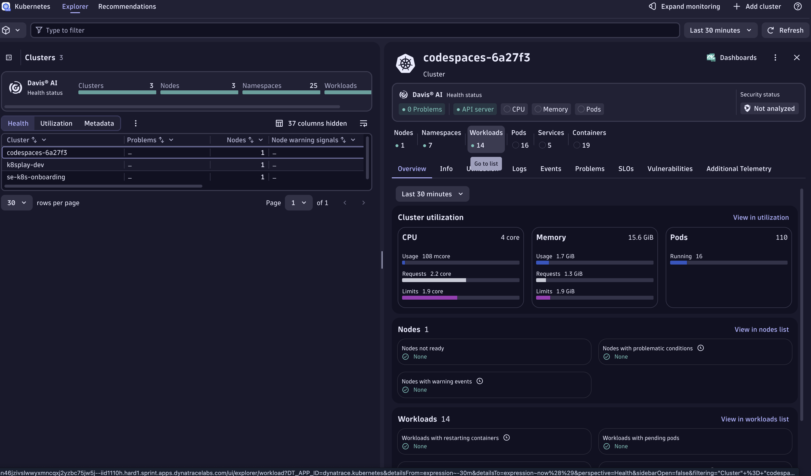

# The Bug "Clear Completed"


!!! note "The Bug 'Clear Completed'"
        Level: Beginner

## Open the TODO App and add a couple of tasks


In VSCode open a new terminal and in the Welcome Message you should see a link to the Todo App UI. Click on it. Now add a couple of tasks.
It should look something like this:


- Add a couple of tasks. 
- Complete some of them (or all, depending how productive you are ;) . 
- Now click on: ``Clear Completed`` 


- Are the tasks cleared?

Apparently the button does not work. When clicked - completed todos are not cleared. 

We embark our Bug hunting journey! 

There are multiple ways how dive deep into the issue because Dynatrace is monitoring your Kubernetes cluster, all workloads in it, all it's traces with code level insights and all real users accessing the exposed application.

## Hunting via the Kubernetes Road

- Open the Kubernetes App > You'll see a cluster with the name "codespace-xxxx". That's your Kind cluster being FullStack monitored.



- On the right hand side, click on Workloads, the Workloads Page will open. 

- Select the `todoapp`workload. 


- On the Overview in the right hand side, scroll down and open the Services App. (this are the traces grouped withing Dynatrace Services)


- Click on the Spring Boot one and then on the right corner "View Traces"


- This will open all the traces that went through your application... wow!

As you can see, there are traces with the name "clearCompletedTodos" that just took  a couple ms. In this span it was just 2.98ms. On the right hand side, you can see the Tracing details, look how much data was captured automatically 🤩.


As you can see, in the second node of the span, in the **Code Attributes** section, we can see the ``Code function: clearCompletedTodos`` and the ``Code Namespace: com.dynatrace.todoapp.TodoController`` 

Now we know which method and which package! Let's put our Developer Hat 🎩 and open the Live Debugger.


## What is this?

We prepared for you a few manually introduced bugs in order to learn how to use Rookout.  
The first two will make sure you understand how to create and analyze our default rule - Dump Frame.  
The third bug will introduce a new rule type - Log. You will be walked through the process of editing the rule in order
to add custom elements to it.

For more information about Rule Scripting refer to [our reference](https://docs.rookout.com/docs/rules.html)

## Bug scenarios

__Level: Beginner__
- __The bug: ``Clear Completed`` button does not work. When clicked - completed todos are not cleared.__
    - **Reproduce:** Add a few todos, check one or more as completed using the checkbox on the left of the task and click the ``Clear completed`` button on the bottom right corner.  
      

    - **Debug:**  
        1. Load the app's code from github / local - as explained [in here](README.md#usage) 
        2. In the [Rookout app](https://app.rookout.com), open the file `src/main/java/com/rookout/tutorial/TodoController.java`  
        
        3. Add a `dumpframe` rule on the `return` of the `clearCompleted` function by clicking left to the line numbering (just like you would have created a breakpoint on an IDE)  
         
        4. Try clicking on `Clear completed` again to see the message that pops in the Rookout app
        5. We can now see the whole stacktrace leading to this point and the local variables:  
        
        6. Notice how we created a new variable `todoStore` instead of overriding `todos`
        7. Now we know what the bug is!

__Level: Beginner__
- __The bug: Special characters (<,>,;,`,&,/,\\) are not being accepted as part of the title when Adding or Updating a Todo.__
    - **Reproduce:** Add a todo with special characters. All of these characters should disappear.
    - **Debug:**
        1. In the Rookout app, open the file `src/main/java/com/rookout/tutorial/TodoController.java`
        2. In the addTodo function you will we see that the todo title is being filtered by `replaceAll` with a regex - Let's add a `Dump Frame` to the line after it
        
        3. Try to add a todo with some special characters (e.g: `do <> this`)
        4. We can clearly see both `newTodoRecord.title` and `todoTitle` - which is the cleaned title.
        
        

__Level: Intermediate__
- __The bug: Duplicate Todo adds an invalid todo instead of an exact copy of an existing one.__
    - **Reproduce:** Add a task and when hovering on the text, on the right side you have the **&** symbol. Click on it to duplicate the task.
    - **Debug:**
        1. In the Rookout app, open the file `src/main/java/com/rookout/tutorial/TodoController.java`
        2. Using the **Rules** pane on the right, select the *Rule Type* "Log"
        3. Add the rule in the duplicateTodo function on the line with `todos.add(newTodoRecord);`
        4. Before triggering the rule, let's edit it so it returns what we want
        5. In the **Rules** pane on the right, click the *Edit Rule* (pen) icon next to the rule you just added. It will open up the Rule configuration as a JSON file
        6. On line 37 in the `paths` object let's add a property `"store.rookout.locals.dup": "frame.newTodoRecord"`
        7. On line 51 we have `processing.operations` object, let's add a new operation in the array :
        __name: send_rookout - means we are sending the information to the rookout web application__
        __path: store.rookout.locals.dup - we tell the rule what information to send__

        ```
        {
            "name": "send_rookout",
            "path": "store.rookout.locals.dup"
        }
        ```
        8. Click the save button on the upper pane.
        9. Add and duplicate a todo in order to see the output, now we can see what is being given to the object and match if we have an error in the function (parameters missing or in bad order).
        
        


## Next steps

Head over to [our reference](reference-home.md) to understand all the Rookout components.   
See [our installation guides](installation-overview.md) for platform-specific installation examples.
