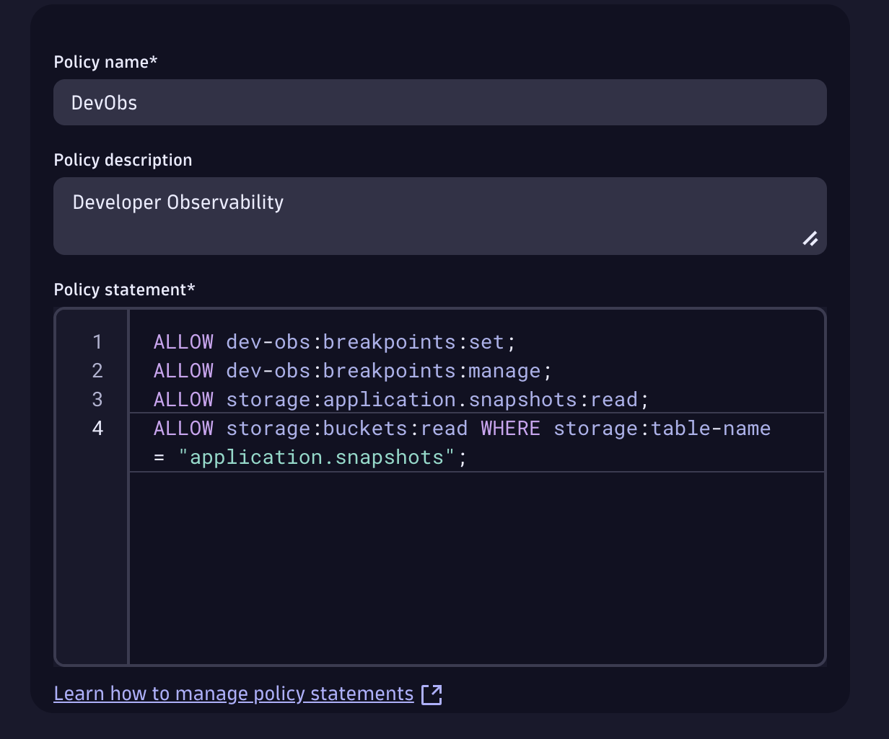
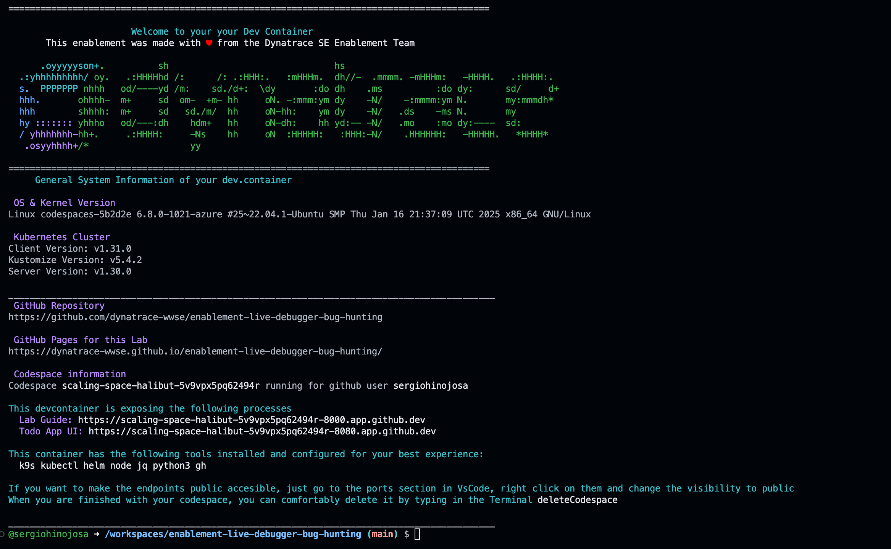

# Getting Started
<!-- 
TODO: verify the js payload on all pages and setup a tenant for monitoring enablement.
 -->
--8<-- "snippets/bizevent-getting-started.js"
--8<-- "snippets/grail-requirements.md"

## 1. Dynatrace Tenant Setup
You will need a Dynatrace SaaS tenant with a DPS pricing model and the 'Code Monitoring' rate card should be associated with it. In addition the application needs to be monitored with Dynatrace FullStack mode. The application runtime: Java, NodeJS.

### 1.1 Enable Observability for Developers

- Go to Settings > Preferences > OneAgent features.
     - Enable the Java Live-Debugger, Node.js Live-Debugger, or both, depending on your needs.
- Go to Settings > Observability for Developers > Enable Observability for Developers

[More information can be found here](https://docs.dynatrace.com/docs/observe/applications-and-microservices/developer-observability/do-enable)


### 1.2 Set IAM Polocies 
We take security very seriously. So let's create a policy to set user-level Live Debugging breakpoints. 

We need two policies for your user to be able to set breakpoints and to read snapshots. 
For this we go to Account Management > Identity & Access management > + Policy

Set breakpoints
```bash
ALLOW storage.application.snapshots:read;
```

Read Snapshopts
```bash
ALLOW storage.application.snapshots:read;
```

The policy should look like this:




Then we bind it to a user group. In this case since we are admins, let's bind the policy to the Admin group. 

Go to Group Management > Select Admin Group > + Permission  (and bind the policy)


Like this you have the fine control to give your developers, SRE teams and whoever you want to set breakpoints and read the snapshots. For more granular access [please continue reading here](https://docs.dynatrace.com/docs/observe/applications-and-microservices/developer-observability/offering-capabilities/setup) 


### 1.3 Enable Live Debugger ActiveGate module

Now we need to enable the [Live Debugger ActiveGate module](https://docs.dynatrace.com/docs/shortlink/do-setup#enable-live-debugging-in-environment-activegate-module):

```yaml
#Set debugging_enabled to true in the custom.properties file.
activeGate:
    customProperties:
      value: |
        [debugging]
        debugging_enabled = true
```
This is already set up for you in the codespaces automatically in the [Dynakube.yaml](https://github.com/dynatrace-wwse/enablement-live-debugger-bug-hunting/blob/main/.devcontainer/yaml/dynakube-skel.yaml) file so no need to restart the ActiveGate.


## 2. Getting the permissions for monitoring the Kubernetes Cluster with Dynatrace
This codespace has everything automated for you so you can focus on what matters which in this enablement is to learn about the Live Debugging capabilities of the Dynatrace Platform.  You'll need two tokens:

1. Operator Token
2. Ingest Token 

We will get this two very easy from the Kubernetes App. 

## 2.1. Get the Operator Token and the Ingest Token from the Kubernetes App
1. Open the Kubernetes App (CTRL + K then type Kubernetes for fast access)
2. Select the + Add cluster button
3. Scroll down to the section Install Dynatrace Operator 
4. Click on generate Token for the 'Dynatrace Operator' and save it to your Notepad
5. Click on generate Token for the 'Data Ingest Token' and save it to your Notepad
6. You can close the Kubernetes App, we don't need it, we just needed the tokens.


!!! tip "Let's launch the Codespace"
    Now we are ready to launch the Codespace! You'll need your tenant and the two tokens previuosly gathered from above. When you enter the tenant please enter it without the 'apps' part, for production tenants eg. abc123 for live -> https://abc123.live.dynatrace.com and for sprint -> https://abc123.sprint.dynatracelabs.com no apps in the URL.


## 3. Launch Codespace

[](https://codespaces.new/dynatrace-wwse/enablement-live-debugger-bug-hunting){target="_blank"}


## 3.1 Machine Type & Variables

As a machine type select 4-core and enter your credentials within the following variables:

- DT_TENANT
- DT_OPERATOR_TOKEN
- DT_INGEST_TOKEN


## 4. While the Codespace is set-up for you, learn powerful usecases for Live Debugging
We know your time is very valuable. This codespace takes around 6 minutes to be fully operational. A local Kubernetes ([kind](https://kind.sigs.k8s.io/){target="_blank"}) cluster monitored by Dynatrace will be configured and in it a sample application, the TODO app will be deployed. To make your experience best, we are also installing and configuring tools like:

**k9s kubectl helm node jq python3 gh**

While the Codespace is being set up for you, [here is a 6 minute read about powerful use cases beyond live debugging](https://www.dynatrace.com/news/blog/5-powerful-use-cases-beyond-debugging-for-dynatrace-live-debugger/){target="_blank"}
in our Dynatrace blog.


## 5. Explore What Has Been Deployed

Your Codespace has now deployed the following resources:

- A local Kubernetes ([kind](https://kind.sigs.k8s.io/){target="_blank"}) cluster monitored by Dynatrace, with some pre-deployed apps
  that will be used later in the demo.

- After a couple of minutes, you'll see this screen in your codespaces terminal. It contains the links to the local expose labguide and the UI of the TODO application which we will Live Debug.



!!! Warning "TODO"
    TODO: Create some context on Bugs, Some Breaking Points stuff, elevate the talk for Developers.


## 6. Troubleshooting
!!! Warning "TODO"
    TODO: Troubleshooting steps on the codespace, also add tips and tricks, show that the functions are loaded in the shell.


<div class="grid cards" markdown>
- [Let's start our Bug hunting quest:octicons-arrow-right-24:](bug-clear-completed.md)
</div>
