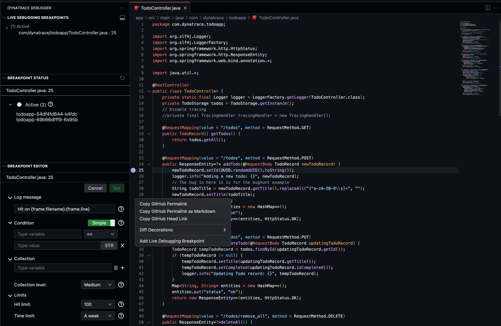

--8<-- "snippets/ide-integration.js"

!!! example "🧑‍💻 IDE Integration"
    We love Developers and the developer's experience, we understand that for better and faster Software development a developer does not leave it's IDE. We support JetBrains and VSCode as one of the most common IDE's out there. [Here you can read more about the extensions](https://docs.dynatrace.com/docs/observe/applications-and-microservices/developer-observability/offering-capabilities/ide-integration).

## Launch the IDE from your Browser

On the top left, click on the VS Code menu (the 3 lines), and then click on "Open in VS Code Desktop". This will launch your local VS Code IDE. If you don't have VS Code already installed in your computer, you can download and install it directly from here: [https://code.visualstudio.com/](https://code.visualstudio.com/){ :target="_blank" }

{ width="300" }

[Download VS Code](https://code.visualstudio.com){ :target="_blank" .md-button }

## Codespaces experience in your IDE

Now your Codespace is open inside your VS Code IDE. You'll notice that you have now the full IDE experience, you can drag and drop files inside and outside the IDE from your OS and VSCode will automatically add them in the container that is being managed by your codespace. 

The application is now being exposed and mapped to your localhost. In this case the TODO app is being mapped to port 30100, so you will be able to access it like this: [http://127.0.0.1:30100](http://127.0.0.1:30100){:target="_blank"}

## Get the Dynatrace extension

On the left pane, click on "Extensions", then search for "Dynatrace" > Select "Observability for Developers" and click on "Install in Codespaces"

## Select the stage you want to connect

Great! now that you have the Dynatrace extension installed in your IDE. Unless you are using a DEV or Hardening (sprint) tenant, this configuration is not needed since th default is "production". All our Free Trials and customers run in production environments. 
If you are using a DEV or sprint tenant, here is how to configure it. Inside the extension, click on the "settings wheel" > select "Settings" and click on it.

The extension settings will open. You can select the environment you want to connect. As options you'll get:

1. development  
2. sprint       
3. production (default)

Select the desired environment and that's it. You can select it for the User, Remote CS instance and for the Workspace.

## Login to Dynatrace SSO

Now let's login to the environment using SSO. On the bottom pane, there is a tab called "Dynatrace Snapshots", open it.  Click on the button "Log in".

This will open a browser and will pass on the SSO credentials to your IDE via http://localhost:3232. When the browser tab opens, enter your credentials, login and accept the pop up to connect back to VS Code. 

??? Warning "Loggin in keeps loading... and how to fix it"
    If after you enter your login credentials in the browser, the extensions keeps on loading, just restart the extension so it can authenticate properly. Passing in the credentials from the Browser to the Dynatrace Extension that is running in VS Code inside a container, might fail and needs a refresh so it loads properly. 
    
    Just type ***[Ctrl]+[Shift] + P : Developer: Restart Extension Host***
    {width: 200}

## Select the tenant ☁️

Since we are using the comfort of SSO, you can select any tenant you have permission on the logged in production or whatever environment you previously selected. For selecting a specific tenant click on the ☁️ cloud icon in the Dynatrace Snapshots tab, and the tenants you have permissions will appear in a drop down.

## Select a running container ✏️

You'll need to specify the instances you want to capture non-breaking break points, for this click on the ✏️ pencil icon in the Dynatrace Snapshots tab and the ``Dynatrace: Instance selection`` tab will open. Select the pod ``todoapp-deploymentHashId-podHashID`` > in th properties filter by ``k8s.workload.name:todoapp``. THis way when the pod gets restarted or in a new deployment, the filter will still apply to it. You can add more filters like ``k8s.namespace.name`` or alike for filtering by namespace or cluster in big environments.

## Set a non-breaking breakpoint

Now open the ``TodoController.java`` Class. Once opened, on the left side of the Class, where the line numbers appear, click on the Line you would like to set a breakpoint. For example let's put a breakpoint inside the method ``addTodo``in the line 25. Right click on the line number, and select **Add Live Debugging breakpoint**. You'll notice after you set the breakpoint, on the left pane (when the extension is selected) you'll have three sections: 

| Method      | Description                          |
| :---------- | :----------------------------------- |
| `LIVE DEBUGGING BREAKPOINTS`       | All active breakpoints for your session with Class and line number  |
| `BREAKPOINT STATUS`       | the status of the breakpoints and the instances that match the breakpoint |
| `BREAKPOINT EDITOR`    | By selecting the Breakpoint in `LIVE DEBUGGING BREAKPOINTS` you'll be able to set the settings for the breakpoint, such as `Log message`, `Conditions` and `Limits`  |

- [Click here to continue :octicons-arrow-right-24:](mask-data.md)

