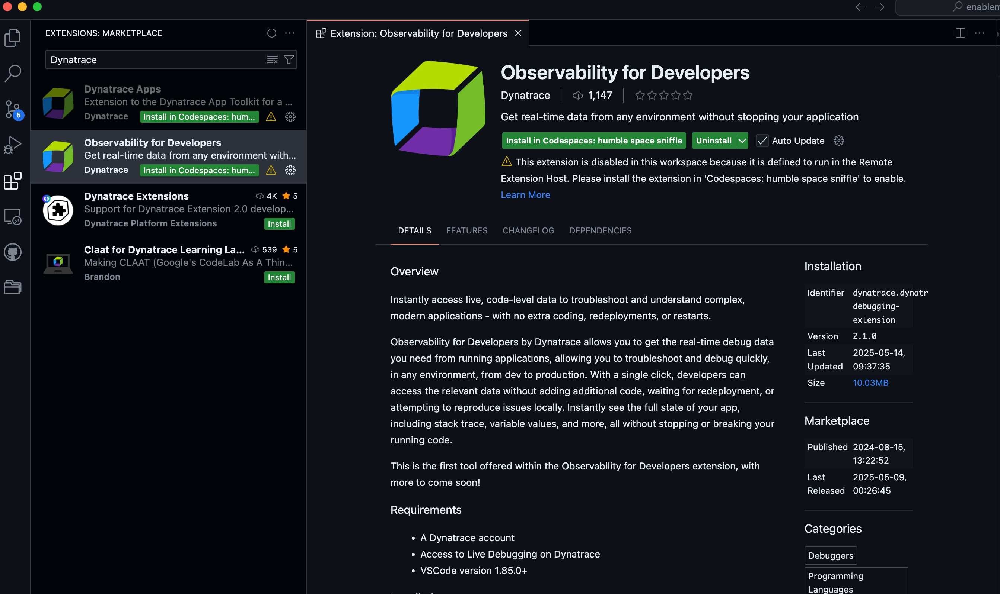
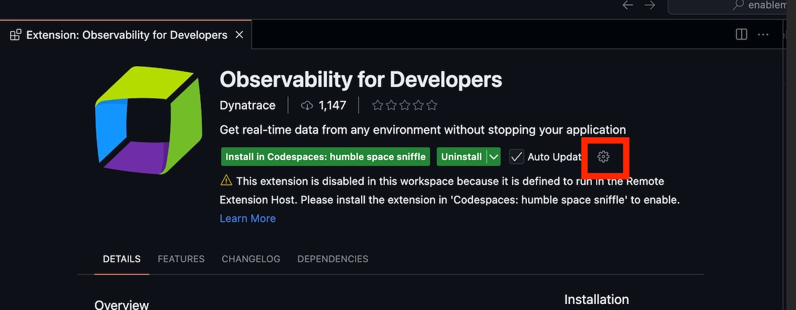
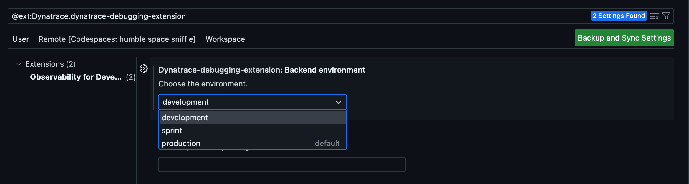
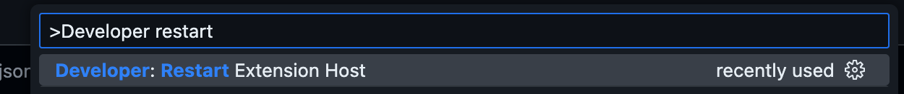
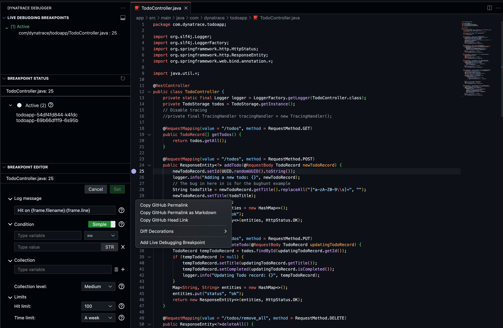

!!! example "🧑‍💻 IDE Integration"
    Developers move fastest without leaving their IDE. Dynatrace supports **VS Code** and **JetBrains** with the *Observability for Developers* extension, so you can set Live Debugging breakpoints and read snapshots right where you write code. [Read more about the IDE extensions](https://docs.dynatrace.com/docs/observe/applications-and-microservices/developer-observability/offering-capabilities/ide-integration).

Everything you did in the Live Debugger app you can also do from your own IDE. This section shows the VS Code flow; JetBrains is equivalent.

## Install the Dynatrace extension

In your IDE, open **Extensions**, search for **Dynatrace**, select **Observability for Developers**, and install it.

[Get VS Code](https://code.visualstudio.com){ :target="_blank" .md-button } [Get the JetBrains plugin](https://plugins.jetbrains.com/plugin/25186-observability-for-developers){ :target="_blank" .md-button }

## Select the environment (DEV / sprint / production)

Most tenants run in **production** (the default — no change needed). Only if you use a DEV or sprint tenant: open the extension's **settings wheel → Settings** and choose the environment.

Options: `development`, `sprint`, `production` (default). You can set it per User, per Remote instance, and per Workspace.

## Log in to Dynatrace via SSO

In the bottom pane, open the **Dynatrace Snapshots** tab and click **Log in**. A browser opens, passes your SSO credentials back to the IDE, and you accept the connection.

??? warning "Login keeps loading — how to fix it"
    If the extension keeps loading after you log in, restart the extension host so it re-authenticates: **[Ctrl]+[Shift]+P → Developer: Restart Extension Host**.
    {width=200}

## Select the tenant ☁️

Click the ☁️ cloud icon in the **Dynatrace Snapshots** tab and pick any tenant you have permission on.

## Select a running container ✏️

Click the ✏️ pencil icon to open **Dynatrace: Instance selection**. Select the `todoapp-...` pod and filter by `k8s.workload.name:todoapp` so the selection survives pod restarts and redeploys. Add `k8s.namespace.name` or cluster filters for larger environments.

## Set a non-breaking breakpoint

Open `TodoController.java`. On the line you want (e.g. line 25 inside `addTodo`), right-click the line number and choose **Add Live Debugging breakpoint**. The extension's left pane shows three sections:

| Pane | Description |
| :--- | :--- |
| `LIVE DEBUGGING BREAKPOINTS` | All active breakpoints with class and line number |
| `BREAKPOINT STATUS` | Status of each breakpoint and the instances it matches |
| `BREAKPOINT EDITOR` | Per-breakpoint settings: `Log message`, `Conditions`, `Limits` |

- [Click here to continue :octicons-arrow-right-24:](mask-data.md)

