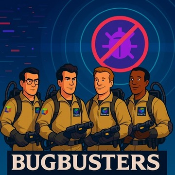

--8<-- "snippets/disclaimer.md"

# Live Debugger Tutorial — Bug Hunting the TODO App

In this hands-on training you embark on a bug-hunting journey through the **Dynatrace Live Debugger** and the wider Dynatrace Platform. A Kubernetes cluster and a sample **TODO application** are already running in your environment — the app works, but it ships with three bugs. Your job is to hunt them down and fix them, in production, without a single redeploy-to-debug cycle.

The Live Debugger is part of [Observability for Developers](https://docs.dynatrace.com/docs/observe/application-observability){target=_blank}. It gives developers instant, code-level debug data to troubleshoot complex, modern applications with **no extra coding, redeployments, or restarts**.

- Debug in any environment or application, on any architecture
- Instant insights and data from any issue
- Full visibility into code
- Robust security and data-privacy controls (data masking on the OneAgent)
- Increase developer satisfaction & happiness — remove the frustration

  

## What you will do

| Step | Bug | Hunt via | Validates |
|------|-----|----------|-----------|
| Prerequisites | — | Enable Live Debugger on your tenant | Cluster + TODO app are running |
| 1 | **Clear Completed** does nothing | Kubernetes App → Traces → Live Debugger | `is_bug1_solved` |
| 2 | **Special characters** are stripped | Distributed Traces → Live Debugger | `is_bug2_solved` |
| 3 | **Duplicate task** swaps title and ID | Logs → Live Debugger | `is_bug3_solved` |

Each bug has two pages: one to **reproduce** the bug, and one to **hunt and fix** it. Every section ends with an automated check you must pass before continuing.

## Environment overview

Your training environment includes:

- A single-node **k3d** Kubernetes cluster, monitored by Dynatrace
- The **TODO application** deployed in the `todoapp` namespace (with the three bugs)
- Your Dynatrace tenant credentials pre-loaded as environment variables (`DT_ENVIRONMENT`, `DT_OPERATOR_TOKEN`, `DT_INGEST_TOKEN`)

!!! tip "Before you start"
    Click **Start Environment** in the status bar above to provision your live environment. Open the **Terminal** tab at any time to run commands against the cluster, and the **Apps** tab to open the TODO app. The shell-check buttons on each step are active only once the environment is ready.

Ready to start the bug-hunting quest and learn how to empower developer productivity with Dynatrace?

- [Yes! let's begin :octicons-arrow-right-24:](prerequisites.md)

!!! note "Branch-delivery test"
    This content was loaded from the `test/branch-delivery` branch (e2e verification 2026-07-02).
