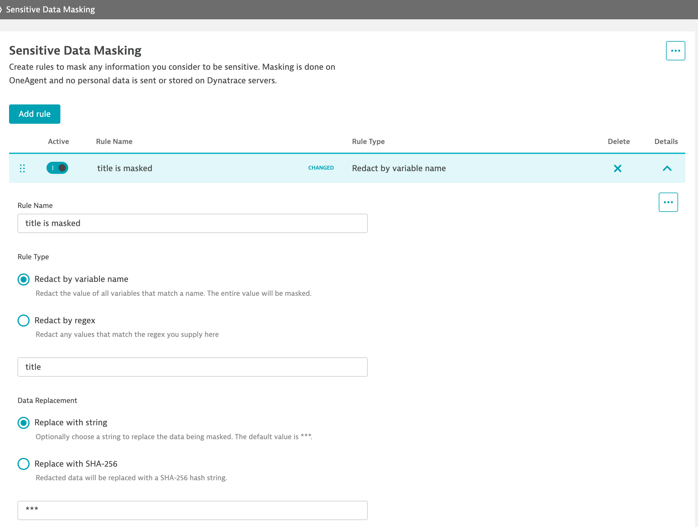

--8<-- "snippets/mask-data.js"

## Data masking 
Dynatrace provides you with tools that enable you to meet your data protection and other compliance requirements while still getting value from any data collected by Dynatrace, including the Live Debugger. 

!!! info "Sensitive Data is never sent to the Dynatrace servers"
    Data maksing within the Live Debugger is done on the OneAgent, which means that no personal data will be sent or stored on Dynatrace servers.

## Data masking settings

| Setting      | Description                          |
| :---------- | :----------------------------------- |
| `Rule name`    | A name to identify the masking rule |
| `Rule Active and Order` | You can activate and deactivate a rules on the fly. You can also move a rule up and down among other rules, meaning the first rule that matches the filter will be the one that is effective. |
| `Rule type`  | 1. **Redact by variable name:** Redact the value of all variables that match a name. The entire value will be masked.   2. **Redact by regex:** Redact any values that match the regex you supply  |
| `Data replacement`  | 1. **Replace with string:** Optionally choose a string to replace the data being masked. The default value is ***   2. **Replace with SHA-256:** Redacted data will be replaced with a SHA-256 hash string. |

## Let's appy a data masking rule to the "title" variable

In your Dynatrace tenant go to:

1. Settings > Observability for Developers > Sensitive data masking
2. Click on "Add rule" and give it a name, e.g. `Title is masked`
3. Rule type we select "Redact by variable name" and enter "title"
4. Data replacement we select "Replace with string" and leave the default value ***
5. Save the rule.

!!! Tip "The Masking Rules are applied on the fly 🚀"
    The masking rules are applied on the fly to all connected processes or containers where they have the Live Debugger active and match a filter for setting non-breaking breakpoints! No restart is required. How awesome is that!?!

The rule should look something like this:

## Verify that the "title" is being masked

Once you have applied the masking rule, open the "Todo app" and add a new task, or remove it, depending the Method where you have the Live Debbugging break

- [Click here to continue :octicons-arrow-right-24:](version-control.md)

