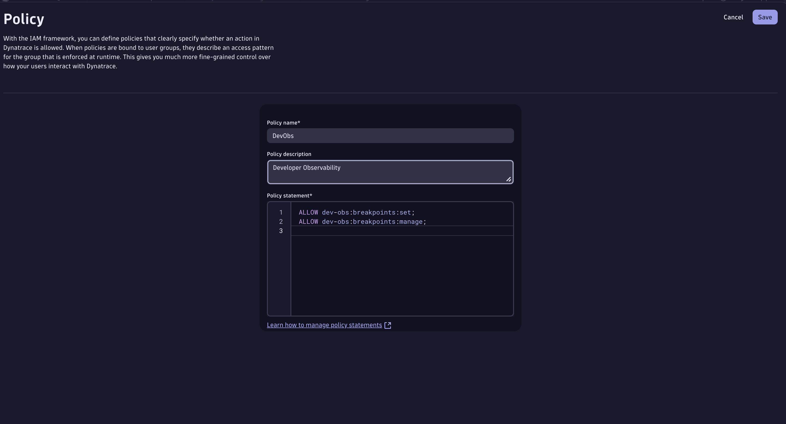
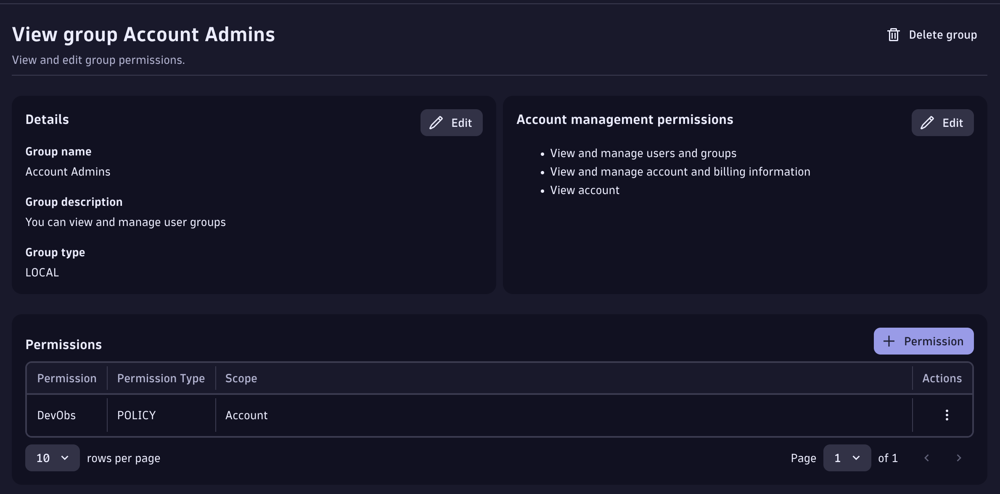
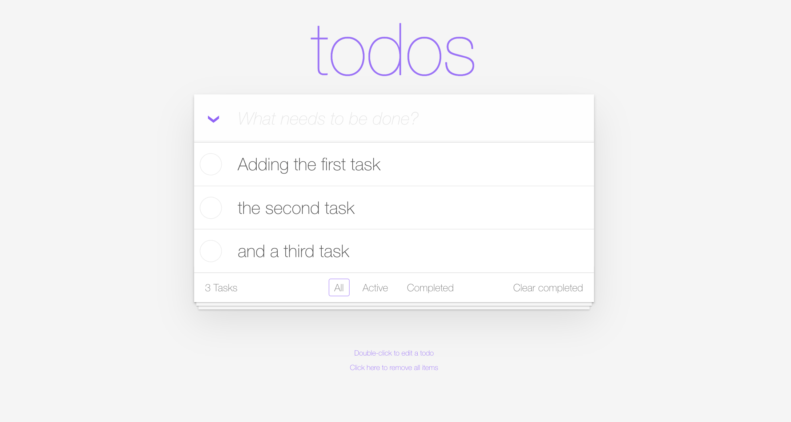

--8<-- "snippets/grail-requirements.md"

# Prerequisites

The Live Debugger reads code-level data from your application through the OneAgent and your Dynatrace tenant. Before hunting bugs, enable the capability on your tenant and confirm your environment is ready. The cluster, the Dynatrace Operator, and the buggy TODO app are **provisioned for you** — you only need to enable the tenant-side settings below.

## 1. Dynatrace tenant setup

You need a Dynatrace SaaS tenant with a **DPS** pricing model and the **Code Monitoring** rate card associated with it. The application is monitored with Dynatrace **FullStack** mode (Java runtime).

### 1.1 Enable Observability for Developers

- Go to **Settings > Collect and Capture > Observability for Developers > Enable Observability for Developers**.
- Go to **Settings > Collect and Capture > General monitoring settings > OneAgent features** and enable the **Java Live-Debugger**.

[More information here](https://docs.dynatrace.com/docs/observe/applications-and-microservices/developer-observability/do-enable)

### 1.2 Set IAM policies

We take security seriously, so create a policy that lets your user set breakpoints and read snapshots. Go to **Account Management > Identity & Access management > + Policy**.

Set breakpoints:
```bash
ALLOW dev-obs:breakpoints:set;
```
Read snapshots:
```bash
ALLOW storage:application.snapshots:read;
ALLOW storage:buckets:read WHERE storage:table-name = "application.snapshots";
```
Manage snapshots (for admins):
```bash
ALLOW dev-obs:breakpoints:manage;
```

The policy should look like this:



Then bind it to a user group (e.g. the Admin group) under **Group Management > Select Group > + Permission**. [More on the IAM model here](https://docs.dynatrace.com/docs/observe/applications-and-microservices/developer-observability/offering-capabilities/setup).



### 1.3 Live Debugger ActiveGate module

The [Live Debugger ActiveGate module](https://docs.dynatrace.com/docs/shortlink/do-setup#enable-live-debugging-in-environment-activegate-module) is **already enabled for you** in this environment's DynaKube (the `debugging` capability is set on the ActiveGate), so there is nothing to restart.

### 1.4 Enable log ingest

The Logs hunt (Bug 3) and the DQL checks need logs flowing from the `todoapp` namespace. In the **Settings** app, go to **Collect and capture > Log monitoring > Log ingest rules** and either enable `[Built-in] Ingest all logs`, or add a rule:

| Field | Value |
|---|---|
| Rule name | `TODO App Logs` |
| Rule type | `Include in storage` |
| Condition | `Kubernetes namespace name = todoapp` |

Then, under **Settings > General monitoring settings > OneAgent features**, enable **Java — Trace/span context enrichment for logs** (and for unstructured logs). Click **Save changes**.

## 2. Confirm the environment is ready

The checks below run against your live environment — both must pass before you continue. Open the **Terminal** tab to run the commands yourself, or just click the check buttons.

### 2.1 Cluster node is Ready

```bash
kubectl get nodes
```

<!-- LAB_QUESTION
type: shell-verification
question: "Verify the cluster node is Ready"
buttonText: "Check Cluster"
command: "kubectl get nodes --no-headers 2>/dev/null | grep -c ' Ready'"
expect:
  operator: gt
  value: 0
hint: "The cluster is provisioned automatically. Wait 30 seconds and try again if it is not ready yet."
explanation: "Cluster node is Ready — the environment is up."
-->

### 2.2 TODO app is running

The TODO application is deployed in the `todoapp` namespace. Open it from the **Apps** tab to interact with it.

```bash
kubectl get pods -n todoapp
```



<!-- LAB_QUESTION
type: shell-verification
question: "Verify the TODO application pods are Running"
buttonText: "Check Application"
command: "kubectl get pods -n todoapp --no-headers 2>/dev/null | grep -c Running"
expect:
  operator: gt
  value: 0
hint: "The application is deployed automatically. If no pods are Running, wait 60 seconds and check the environment log."
explanation: "TODO application pods are Running — your environment is ready."
-->

### 2.3 Dynatrace is observing the app

Confirm Dynatrace is already collecting logs from the TODO app. (You may need to interact with the app first and wait 2–3 minutes for data to flow.)

<!-- LAB_QUESTION
type: dql-verification
question: "Verify Dynatrace is ingesting logs from the todoapp namespace"
buttonText: "Check DT Logs"
dql: |
  fetch logs
  | filter k8s.namespace.name == "todoapp"
  | filter timestamp > now() - 10m
  | limit 1
expect:
  operator: not-empty
hint: "Make sure your log ingest rule (step 1.4) allows the todoapp namespace, then interact with the app and wait a couple of minutes."
explanation: "Logs are flowing from todoapp — observability is active and you are ready to hunt bugs."
-->

!!! success "All checks passed?"
    Continue to **Bug 1: Clear Completed**.

<div class="grid cards" markdown>
- [Let's start the Bug hunting quest :octicons-arrow-right-24:](1-bug-clear-completed.md)
</div>
