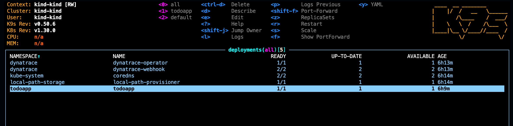

--8<-- "snippets/version-control.js"

!!! Example "Automate the Version Control integration for all your environments"
    With environment variables it's easy to point each deployed application in every stage and kubernetes cluster to the right vesion control, branch and commit.


## Integrate with your version control
When debugging within a remote environment, you need to know exactly what source code it is executing. The Live Debugger integrates with your source control provider to fetch the correct source code for every environment, wheter is development, staging or production environment. Using environment variables within your CI/CD processes, makes it easy and accurate to point to the specific commit, branch and version control for each deployed application. 


| ENV Variable      | Description                          |
| :---------- | :----------------------------------- |
| `DT_LIVEDEBUGGER_COMMIT`    | String that indicates your git commit |
| `DT_LIVEDEBUGGER_REMOTE_ORIGIN` | String that indicates your git remote origin. <br>For multiple sources, use the environment variable DT_LIVEDEBUGGER_SOURCES to <br> initialize the SDK with information about the sources used in your application. |
| `DT_LIVEDEBUGGER_SOURCES`  | is a semicolon-separated list of source control repository and revision information, joined by #.<br> For example: <br> DT_LIVEDEBUGGER_SOURCES=https://github.com/myorg/MyRepo#abc123;https://github.com/otherorg/OtherRepo#xyz789. |


[More information in the official documentation page.](https://docs.dynatrace.com/docs/observe/applications-and-microservices/developer-observability/offering-capabilities/additional-settings#integrate-with-your-version-control)


## Let's automate the version control integration

We recommend to automate the version control integration within the build and deployment process of the applications. This way, when a developer debugs an application in whatever cluster and environment he see's fit, he does not need to manually add nor verify the origins repository, branch and revision that corresponds to the built application. 


### Fetching the version control information automatically

Below is a sample bash script that patches the Kubernetes deployment of the todo application. It'll read the revision for v1.0.0 and the remote URL of the repository and set them accordingly as environment variables in the specific container of the deployment.

[/app/patches/set_version_control.sh](https://github.com/dynatrace-wwse/enablement-live-debugger-bug-hunting/blob/main/app/patches/set_version_control.sh)


``` bash title="set_version_control.sh" linenums="1"
#!/bin/bash

# Small bash script for patching deployments via kubectl, more information about integrating the live debugger with your version control see: 
# https://docs.dynatrace.com/docs/observe/applications-and-microservices/developer-observability/offering-capabilities/additional-settings#integrate-with-your-version-control

# Variable definition
version="v1.0.0"
deployment="todoapp"
container="todoapp"
namespace="todoapp"

DT_LIVEDEBUGGER_COMMIT=""
DT_LIVEDEBUGGER_REMOTE_ORIGIN=""


set_version_control_information(){
    DT_LIVEDEBUGGER_REMOTE_ORIGIN=$(git remote get-url origin)
    DT_LIVEDEBUGGER_COMMIT=$(git rev-parse $version)

    echo "Fetching git revision for $version in $DT_LIVEDEBUGGER_REMOTE_ORIGIN" 
    echo $DT_LIVEDEBUGGER_COMMIT

    export DT_LIVEDEBUGGER_REMOTE_ORIGIN=$DT_LIVEDEBUGGER_REMOTE_ORIGIN
    export DT_LIVEDEBUGGER_COMMIT=$DT_LIVEDEBUGGER_COMMIT
}


patch_deployment(){ 
kubectl patch deployment $deployment -n $namespace -p "$(cat <<EOF
{
    "spec": {
        "template": {
            "spec": {
                "containers": [
                    {
                        "name": "$container",
                        "env": [
                            {
                                "name": "DT_LIVEDEBUGGER_COMMIT",
                                "value": "$DT_LIVEDEBUGGER_COMMIT"
                            },
                            {
                                "name": "DT_LIVEDEBUGGER_REMOTE_ORIGIN",
                                "value": "$DT_LIVEDEBUGGER_REMOTE_ORIGIN"
                            }
                        ]
                    }
                ]
            }
        }
    }
}
EOF
)"
}

set_version_control_information
patch_deployment

```

### Patch the Kubernetes deployment

``` bash title="Patch the kubernetes deployment in Codespaces by executing the following script:"
bash app/patches/set_version_control.sh
```

### Verify that the container has the version control information
We can easily verify that the pod has the environment variables set. With the help of k9s we can easily navigate and describe the deployment.

- Type `k9s`
- Inside k9s type (semicolon) `:` then `deployment`, then `0` to list all deployments in all namespaces.



- Now select `todoapp` and type `d` to Describe the deployment, you should see something like this:


The DT_LIVEDEBUGGER_COMMIT and DT_LIVEDEBUGGER_REMOTE_ORIGIN environment variables are setted accordingly.


### Open the Live Debugger and verify that the Version Control is setted automatically

- Go to Dynatrace and open the Live Debugger.
- In case you have an old session, click on "New Session" 
- Select the "todoapp" container and verify that the hash matches the actual POD that has been re-deployed after the patch. 
- After you click on "Next" the repository should be fetched automatically like the following screenshot matching the remote URL and the revision ID.


<div class="grid cards" markdown>
- [Click here to continue :octicons-arrow-right-24:](grail-and-dql.md)
</div>
